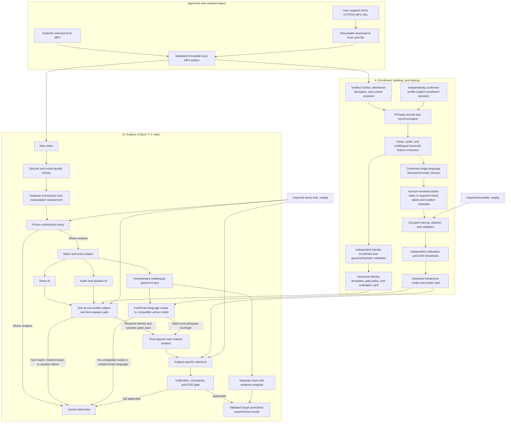

# VerityWorkbench: Person-Specific Multimodal Veracity Research Workbench

**Project status:** Active research prototype and forward-looking research blueprint

**Research snapshot date:** August 15, 2026

**Product name:** VerityWorkbench

**Proposed platform:** Local-first Windows desktop application in C#/.NET

**Distribution direction:** Open-source software with private, user-supplied media and person-specific artifacts

**Initial approved media inputs:** Explicitly selected local MP4 files or user-supplied direct HTTP(S) MP4 media URLs that are downloaded and finalized locally before processing

**Working description:** A person-specific system for studying whether synchronized facial, vocal, and linguistic changes are associated with independently verified intentional deception under controlled, comparable conditions.

**Current implementation snapshot:** Implementation Milestone 7 adds explicit recording dependency groups to the persistent profile, local MP4 ingest, complete selected-stream validation, deterministic preprocessing, and prepared-media review path. Each group has a stable profile-scoped ID and editable display label, and each training selection can be explicitly assigned without deriving experimental structure from its recording-date label. Existing selections migrate to `Unassigned`; active assigned-group, unassigned-selection, and shared-media-asset conflict counts are reported without claiming an independent sample size. Processing/readiness, prepared-media review, and unavailable Query Profile behavior are unchanged. Media quality and model applicability remain `NotAssessed`; transcription, feature extraction, identity/authenticity/language assessment, training, inference, and scoring are not implemented. This implementation-slice numbering is distinct from the longer-term scientific delivery roadmap in Section 14.

## 1. Executive summary

The proposed software is technically feasible as a research application. It can ingest an MP4, isolate a selected subject, extract synchronized facial, vocal, and transcript features, compare those features with a subject-specific model, and display results at the model's trained and validated granularity.

The Windows application centers on three actions: **Add Profile**, **Edit Profile**, and **Query Profile**. A profile represents one pseudonymous subject, that subject's authorized training artifacts, processing workspace, model history, and current query eligibility. A profile may be created from curated training videos, an imported model package, or both.

Non-English media are supported through local multilingual speech recognition. The application preserves the original-language transcript and may create a clearly separate English translation, but each initial behavioral model version is trained, calibrated, evaluated, and queried in one confirmed spoken language. Indeterminate/code-switched language evidence or the absence of a compatible active model blocks behavioral scoring rather than being hidden by translation.

The application follows a **bring-your-own-video, local-only** boundary. It does not provide, discover, scrape, or bundle subject footage. Every newly added training or future-analysis video must enter as an explicitly selected local MP4 or a user-supplied direct MP4 media URL that the application downloads to a local private workspace. The public source repository contains no real subject footage, extracted biometric data, consent records, or person-specific model packages.

It is not presently scientifically defensible to market the application as a general-purpose lie detector or to assume that every person has a stable detectable “tell.” The system must first test whether a repeatable person-specific signal exists and whether it survives completely new recording sessions. Some subjects may be modelable under a narrow protocol; others may have no reliable signal.

The strongest defensible product keeps two prerequisite assessments and three analysis outputs deliberately separate.

Prerequisite assessments:

1. **Profile-subject verification:** Whether the selected face track matches the pseudonymous subject enrolled in the chosen profile strongly enough for analysis, whether the speech is associated with that face, and—only when required by the frozen profile policy—whether the voice biometrics match.
2. **Media-authenticity assessment:** When a separately validated module is available, whether it found supported indicators of synthetic, replayed, or manipulated media; absence of an alert is not proof of authenticity.

Analysis outputs:

1. **Behavioral deviation:** How unusual the verified subject’s current facial and vocal behavior is relative to verified personal baselines.
2. **Experimental deception-model score:** A model result available only after training on both verified truthful and verified intentional-deception examples and validating on independent future sessions.
3. **Claim-evidence assessment:** Whether external evidence supports, contradicts, or cannot resolve each spoken factual claim.

Profile-subject verification is a mandatory, separately constructed, versioned, and evaluated applicability gate. The behavioral/deception model must never double as an identity recognizer, and it produces no result for material that does not pass the identity, speaker-association, quality, context, and OOD gates. Media-authenticity handling follows an explicit frozen policy rather than being silently treated as identity evidence.

A percentage must never be created directly from a neural-network confidence score. It may be displayed only after prospective, target-condition calibration demonstrates that the percentage has empirical meaning. Otherwise, the application must display an experimental score, a deviation score, or **cannot determine**.

This is therefore best framed as a **multimodal veracity research workbench**, not a consumer lie detector.

## 2. The exact concepts must remain separate

The application keeps five questions separate:

- **Profile-subject match and speaker association:** Does the query face match the pseudonymous person enrolled in this profile, is the analyzed speech associated with that face, and—only when required—does the voice-biometric evidence match?
- **Media authenticity:** Is there supported evidence that the recording is synthetic, manipulated, replayed, or otherwise not an ordinary capture?
- **Factual accuracy:** Is the proposition correct in the outside world?
- **Speaker belief:** Does the speaker sincerely believe the proposition?
- **Intentional deception:** Is the speaker knowingly attempting to create a false belief?

These are not interchangeable. A genuine recording of a different person can fail profile verification without being fake. A face swap or voice clone of the enrolled person can sometimes pass an ordinary identity matcher. A genuine recording can fail verification because of quality, aging, illness, pose, or equipment changes. A person can sincerely state something false, or make a technically true statement while intentionally creating a misleading impression through omission or framing.

Facial and vocal behavior cannot establish factual truth by themselves. At most, those modalities may contain behavioral correlates of an experimentally defined state such as intentional deception. Factual accuracy is better assessed through the transcript and external evidence.

The primary scientific target for the personalized behavioral model should be:

> Given subject S and a sufficiently comparable context C, do synchronized facial, vocal, timing, and linguistic changes predict independently verified intentional deception better than chance in a completely future recording session?

The desired statistical quantity, if validation eventually supports it, is not a universal probability. It is:

> P(intentional deception | measured features, this subject, this protocol, this context)

That qualification must remain visible in the model card and user interface.

## 3. Scientific findings reviewed

### 3.1 Human and behavioral deception detection

- Human truth/lie judgments average approximately 54% across 206 reports and 24,483 judges. Experts were not reliably superior in controlled comparisons. [Bond and DePaulo](https://pubmed.ncbi.nlm.nih.gov/16859438/)
- A major meta-analysis covering 1,338 estimates of 158 behavioral cues found that many behaviors had no discernible relationship with deception and that the typical effects were weak. The median absolute effect among well-studied cues was approximately d = 0.10. Eye contact, response latency, and response length were near zero in that analysis. [DePaulo et al.](https://doi.org/10.1037/0033-2909.129.1.74)
- Further meta-analytic work concluded that deception-judgment accuracy is limited mainly by the weakness of behavioral signals, not merely by poorly trained observers. [Hartwig and Bond](https://pubmed.ncbi.nlm.nih.gov/21707129/)
- A broad review described nonverbal deception cues as faint and unreliable. [Vrij, Hartwig, and Granhag](https://doi.org/10.1146/annurev-psych-010418-103135)

### 3.2 Faces, expressions, and microexpressions

- Facial movements do not uniquely and reliably identify even a particular emotion across people, cultures, situations, and contexts. The further inference from facial movement to emotion to deception is therefore especially uncertain. [Barrett et al.](https://pubmed.ncbi.nlm.nih.gov/31313636/)
- In a randomized study, microexpression training did not improve lie detection; overall performance was slightly below chance. [Jordan et al.](https://doi.org/10.1002/jip.1532)
- A critical review notes that microexpressions are rare, can occur in both truthful and deceptive people, and should not be treated as a validated lie marker. [Burgoon](https://doi.org/10.3389/fpsyg.2018.01672)
- A recent cross-database study found that facial deception models that performed promisingly within one dataset frequently deteriorated sharply, sometimes below chance, on another dataset. Microexpression models could approach roughly 80% within a dataset yet fail to exceed random performance across databases. [Cross-database facial study](https://doi.org/10.1007/s00521-024-09811-x)

### 3.3 Personalized baselines

Knowing a person’s truthful baseline may provide a small benefit in some controlled studies, but findings are inconsistent. One meta-analytic comparison found roughly 55.9% accuracy with baseline exposure versus 52.3% without it. Other controlled work found null or inconsistent improvements, especially when the baseline topic and stakes were not comparable to the questioned material. [Verigin et al.](https://pmc.ncbi.nlm.nih.gov/articles/PMC8451647/), [Bogaard et al.](https://doi.org/10.1002/acp.3990), [Baseline comparability study](https://pmc.ncbi.nlm.nih.gov/articles/PMC6762160/)

Person-specific signals can appear under constrained conditions:

- A facial-electromyography study with 40 participants and many repeated trials reported approximately 73% average within-person accuracy. The informative muscle differed by person, and some participants’ apparent signal changed over time. [Person-specific facial EMG study](https://pmc.ncbi.nlm.nih.gov/articles/PMC8671780/)
- A webcam-plus-smartwatch experiment reported approximately 75–87% within-person accuracy, but it included only four young male participants, used temporally related samples, and documented false positives from ambiguity and lingering stress. It does not validate ordinary natural video. [Webcam and smartwatch study](https://pmc.ncbi.nlm.nih.gov/articles/PMC10141812/)

These results support investigating personalization, but not assuming that every person has a stable tell.

### 3.4 Audio and speech

Audio adds useful measurements: pitch, intensity, pauses, speech rate, voice quality, response latency, turn-taking, and the spoken words themselves. However, vocal stress reflects arousal and cognitive load, not deception uniquely.

- Controlled testing of layered voice analysis found approximately chance-level detection, with false-positive rates reported between 40% and 65%. [Harnsberger et al.](https://pubmed.ncbi.nlm.nih.gov/19432740/)
- A meta-analysis of computer-detected linguistic cues found theory-consistent differences in some areas, but the overall effect was small and moderated by event type, involvement, emotional valence, motivation, and interaction conditions. [Hauch et al.](https://pubmed.ncbi.nlm.nih.gov/25387767/)
- UNIDECOR experiments across 14 textual deception corpora found that linguistic cues and models generalized poorly across dissimilar domains. [UNIDECOR](https://aclanthology.org/2023.wassa-1.5/)
- Acoustic and lexical features can predict whether humans perceive a speaker as trustworthy without reliably predicting actual deception. In one controlled study, human deception judgments were approximately 50% correct. [Chen et al.](https://aclanthology.org/2020.tacl-1.14/)

Audio is therefore valuable in two distinct ways:

1. It strengthens a personal behavioral-deviation model.
2. Its transcript enables claim extraction, consistency analysis, and evidence checking.

The second use is more directly related to factual correctness. It still does not prove the speaker’s intent.

### 3.5 Multimodal machine learning

Combining audio, video, and text can improve results inside a particular dataset, but the improvement is inconsistent and often disappears under domain shift.

- The DOLOS study reported approximately 59.2% accuracy for audio, 61.4% for video, and 66.8% for its strongest audiovisual configuration under within-dataset evaluation. Cross-dataset results were generally much lower. [DOLOS](https://openaccess.thecvf.com/content/ICCV2023/html/Guo_Audio-Visual_Deception_Detection_DOLOS_Dataset_and_Parameter-Efficient_Crossmodal_Learning_ICCV_2023_paper.html)
- A cross-domain benchmark spanning multiple audiovisual deception datasets reported best average fusion accuracy of 56.82% for single-source transfer, 58.88% for multi-source transfer, and 59.02% for its proposed domain-generalization method. Audio-only cross-domain variants were commonly near 51–53%. [Cross-domain audiovisual benchmark](https://arxiv.org/html/2405.06995)
- A 2025 multimodal evaluation found inconsistent modality gains. On one dataset, text alone outperformed audio, video, and all-modal models; several audio/video language models were near chance. [ACL 2025 multimodal evaluation](https://aclanthology.org/2025.acl-long.1497/)
- A registered replication of high-stakes public-plea behavioral cues found that some individual associations repeated, but the combined predictive model did not exceed chance in the replication sample. [Registered replication](https://pubmed.ncbi.nlm.nih.gov/40146559/)

This evidence makes context matching, independent-session testing, and abstention essential.

### 3.6 Why truthful-only training cannot produce a truth probability

Truthful examples for subject S estimate only:

> p(features | truthful, S)

They do not estimate:

> p(features | intentional deception, S)

They also do not supply the relevant truth/deception base rate. Infinitely many possible deception distributions are compatible with the same truthful baseline while producing different posterior probabilities.

Truthful-only enrollment can therefore support only:

- distance from the person’s known truthful baseline;
- an unusualness percentile;
- a behavioral-deviation score.

It cannot identify P(truthful | video). Adding audio increases the number and quality of measurements but does not solve this identifiability problem.

### 3.7 Probabilities require separate calibration

A classifier output or neural softmax is not automatically a probability. Modern neural networks can be poorly calibrated even when test data resemble training data, and calibration usually deteriorates under distribution shift. [Guo et al.](https://proceedings.mlr.press/v70/guo17a.html), [Ovadia et al.](https://proceedings.neurips.cc/paper_files/paper/2019/hash/8558cb408c1d76621371888657d2eb1d-Abstract.html)

The application may show a percentage only after a separate calibrator has been fitted on independent multi-session data and a prospective series of many independent sessions/outcomes demonstrates reliability across the relevant score range. A single locked T+1 session can test workflow and prospective discrimination, but it cannot establish that a 70% prediction corresponds to an event rate near 70%.

Probabilities also depend on prevalence. A calibrator fitted to a deliberately balanced truth/deception experiment does not automatically transfer to natural or public-video conditions where the class prior is unknown or different. Deployment percentages require target-population calibration or a justified prior-probability adjustment. AUPRC must always be interpreted against the target prevalence baseline.

## 4. Proposed product definition

### 4.1 Intended use

The initial application is a local, consent-based research workbench for:

- adding, editing, archiving, importing, exporting, and querying person-specific profiles;
- managing subjects and recording sessions;
- ingesting synchronized video and audio;
- creating independently supported whole-video or segment intent labels and separate claim-level factual labels;
- extracting reproducible multimodal features;
- training and validating a separate model for each subject;
- running a locked prospective T+1 study;
- analyzing factual claims against cited evidence;
- determining whether the original hypothesis survives testing.

The application does not supply or search for public footage. Initially, a user may import media only by explicitly selecting one or more local MP4 files or supplying an authorized direct HTTP(S) MP4 media URL. A folder picker may enumerate supported files for review, but the application does not recursively or silently import a directory. The user must affirm that they have the necessary rights and consent for acquisition, behavioral analysis, retention, and labeling. Public availability alone is not permission, and public footage must not silently become person-specific behavioral training data.

Webpage, playlist, streaming-service, and social-media page URLs are outside the approved input contract. The project will not bundle a general-purpose site ripper, browser-cookie extractor, DRM bypass, or background media harvester.

### 4.2 Explicitly prohibited uses

The system must not be used to make or support consequential judgments in:

- employment;
- policing or criminal investigations;
- courts or evidence evaluation;
- immigration;
- education;
- housing;
- credit, insurance, or benefits;
- healthcare;
- coercive personal or relationship disputes.

It must not automatically call anyone a liar. An experimental score is not proof of deception.

### 4.3 Recommended outputs

When training labels, aligned features, and validation support that granularity, results should be answer- or claim-level rather than one score for an entire video, because a video can mix facts, mistakes, opinions, omissions, exaggerations, and intentional deception. Otherwise, the application must stay at the coarser validated level.

For each claim or answer, the UI should show:

- **Profile-subject verification:** Match, non-match, or indeterminate against the selected profile, with face coverage and verifier/threshold version.
- **Identity continuity:** Consistent or mixed/changing across the relevant track and time range.
- **Speaker association:** Associated, different speaker, or unable to verify speaker association; optional voice-biometric matching remains a separate field when the frozen profile policy requires it.
- **Media-authenticity assessment:** Not assessed, no supported manipulation detected, possible synthetic/manipulated media, or inconclusive. This is separate from subject identity.
- **Spoken-language evidence:** Confirmed BCP 47 tag, unable-to-determine state, or unsupported code-switching state, with confidence and usable-speech coverage.
- **Language-model routing:** Selected compatible active model, no active model for the confirmed tag, or required language dependency unavailable.
- **Model applicability:** Does this footage resemble validated conditions?
- **Media quality:** Are the correct face and voice measurable?
- **Behavioral deviation:** How unusual is this segment relative to the subject’s baselines?
- **Experimental deception-model score:** Only if both-class training and validation requirements are satisfied.
- **Uncertainty:** Confidence interval or uncertainty band.
- **Claim evidence:** Supported, contradicted, disputed, unresolved, or non-factual.
- **Reasons for abstention:** Missing face, poor audio, indeterminate/code-switched language, no compatible active language model, unavailable dependency, unfamiliar context, insufficient data, model instability, or failed calibration.

Together these fields form the result vector. They remain separate dimensions; the application never compresses identity, authenticity, applicability, behavioral direction, uncertainty, and factual evidence into one “truth” number.

The default outcome is **cannot determine**, not forced binary classification.

The UI must not use **not real** as a technical result because it ambiguously conflates a wrong person with manipulated media. The user-facing identity label for a sufficiently supported non-match is **Does not match profile subject**. At query scope its explanation is **This video cannot be evaluated with the selected profile**; at segment scope it is **This segment was not scored**. Poor-quality or conflicting identity evidence produces **Unable to verify profile subject**, not non-match. A face match paired with adequately established different speech produces **Different speaker — this segment was not scored**; insufficient association evidence produces **Unable to verify speaker association — this segment was not scored**. Manipulation screening, when available, uses **Possible synthetic or manipulated media** and is never presented as proof that a video is fake or genuine.

The Query UI may present transcript sentences with clickable timestamps, but a presentation row is not automatically an independent claim or prediction unit. Result granularity must match the model's labeled and validated target. A whole-video model cannot manufacture sentence-level probabilities; sentence rows may only show a clearly shared parent result. An uncalibrated score is never shown with a percent sign. A calibrated percentage, if ever permitted, is labeled as an estimated probability of intentional deception under the named profile/protocol/context—not truth confidence or factual truth.

### 4.4 Open-source and private-data boundary

The application source, training and evaluation pipeline, schemas, tests, and reproducibility documentation are intended to be open source. Apache License 2.0 is the provisional license recommendation because it is permissive and contains an explicit contributor patent grant; the final project license must be selected before accepting outside contributions or publishing a release.

Open sourcing the software does not open the user's data. The following remain private. Original media, media derivatives, raw transcripts, free-text claim/evidence content, local paths, and source URLs always remain outside `.vwpkg`; only the strictly allowlisted model and numeric artifacts defined in Sections 8.6–8.7 may leave the workspace when the user deliberately creates and transfers an encrypted package to an explicitly authorized recipient:

- original and downloaded videos;
- extracted frames, audio, transcripts, landmarks, voice measurements, and other biometric or behavioral features;
- consent and rights records;
- labels and evidence records;
- person-specific training, calibration, and test partitions;
- trained person-specific models, calibration packages, reports, and audit history.

Users may deliberately exchange encrypted model packages with authorized colleagues. This is a user-directed export, not transmission to the project maintainers or a hosted service. Export is governed by a strict allowlist and never includes original videos, playback proxies, extracted audio, frames, face crops, thumbnails, raw transcripts, temporary files, source URLs, or original local paths. Person-specific models and numeric behavioral features remain sensitive derived data even when source media is excluded.

The public repository and public application release packages must contain no real subject media or person-specific weights. Test fixtures must be synthetic or use performers with explicit, documented releases. A future generic pretrained model would require its own model license, model card, training-data provenance, and release review.

True open-source licensing permits downstream use for any field of endeavor, including commercial use. The prohibited-use list in this document is therefore an intended-use and safety policy, not an added field-of-use restriction on the open-source license. If enforceable use restrictions are later required, the distribution would be source-available rather than OSI open source and would require a deliberate licensing decision.

## 5. Dataset and labeling protocol

### 5.1 Required label dimensions

Every claim should store these dimensions separately:

- factual status: true, false, disputed, unverifiable, or non-factual;
- speaker-belief status: believed true, believed false, or unknown;
- intent status: sincere, intentional deception, ambiguous, or unknown;
- evidence and provenance supporting the label;
- annotator and review status;
- label confidence;
- recording session and context metadata.

The behavioral classifier should train only on claims with credible intent labels. Factual incorrectness alone must not be converted into an intentional-deception label.

The Add/Edit Profile UI presents two explicit training lists: **Verified truthful videos** and **Verified intentional-deception videos**. Bucket placement is a user- or adjudicator-supplied enrollment label, never model-generated ground truth. A whole MP4 may receive one of these labels only when the user has carefully curated the entire recording and can independently support that condition for every eligible target-subject answer used in training. Store the label scope, verification method, provenance, reviewer, and confidence; eligible target-subject segments may inherit the whole-video intent label. Mixed, interrupted, noncompliant, other-speaker, voice-over, B-roll, off-condition, or uncertain material must instead receive segment-level handling or remain ambiguous and excluded. Factual status remains separate from intent.

The user-entered recording date is display and sorting metadata. It is stored exactly as entered and is not a behavioral feature, classifier input, or source for a recording dependency-group assignment. Session identity and explicit experimental grouping—not a recording label or filesystem timestamp—control leakage-safe splitting.

### 5.2 Required data classes

At minimum:

1. Verified sincere-truth examples.
2. Verified intentional-deception examples.
3. Unknown or ambiguous examples that are retained for auditing but excluded from supervised training.

Newly added training and T+1 media must first become a validated local MP4 artifact through one of the two approved media paths. Training never reads from a remote stream, webpage, playlist, or transient URL, and it never silently re-downloads a prior input. Once imported, the content hash—not the source URL—is the stable identity used by experiments and models. Verified numeric artifacts from an imported trainable `.vwpkg` use the separate package-import contract and do not require the original media to be present.

Useful control conditions include:

- truthful and relaxed;
- truthful under stress;
- deceptive and visibly stressed;
- calm or rehearsed deception;
- easy and difficult truthful recall;
- easy and difficult deception;
- spontaneous and prepared answers.

These controls help distinguish deception from stress, cognitive difficulty, uncertainty, and rehearsal.

For controlled collection, truth-versus-deception instructions should be randomized and counterbalanced within each subject across prompts, order, and sessions. Interviewer behavior should be standardized and, where feasible, blinded to the assigned condition. Manipulation/compliance checks should confirm that the participant understood and followed the instruction. Independent adjudicators should review label provenance, with agreement and disagreements recorded.

### 5.3 Situational matching

Training on TV interviews and evaluating on future comparable TV interviews is more defensible than transferring the model to podcasts, courtrooms, home videos, or unrelated settings. Situational matching reduces confounding but does not eliminate it.

Spoken language is part of the validated context because language changes vocabulary, syntax, discourse structure, rhythm, timing, and prosody. The initial behavioral model contract is single-language: all eligible target-subject training, calibration, and evaluation material for one model version uses the same user-confirmed language. A profile may eventually hold separate validated model versions for different languages, but the application does not pool languages into one behavioral model unless that multilingual design is separately evaluated and accepted.

TV interviews can still differ in:

- topic sensitivity and personal stakes;
- interviewer style and aggressiveness;
- question difficulty;
- live versus prerecorded format;
- preparation and rehearsal;
- audience presence;
- fatigue, health, mood, or medication;
- camera, microphone, editing, compression, and broadcast chain.

Truth and deception examples must not be separated by episode or production source. If all truthful labels come from one interview and all deceptive labels from another, the model may learn the host, microphone, camera, topic, or episode rather than deception.

Language must also be balanced across conditions. A dataset in which sincere-truth material is in one language and intentional-deception material is in another is ineligible because the model could learn language rather than behavior.

### 5.4 Independent experimental units

Frames and overlapping windows from the same video are not independent examples. The effective sample size is based on independent sessions, prompts, and claim episodes.

Data splitting must occur by complete:

- recording session;
- synchronized capture group;
- interview or episode;
- prompt or topic;
- source and production condition.

No adjacent segment from a training interview may appear in validation or testing. All normalization statistics must be fitted using training sessions only.

Synchronized camera views of the same answer, repeated encodings of the same file, and clips cut from the same recording remain one experimental unit. They must stay together in the same split and must not inflate the effective sample size.

Implementation Milestone 7 records the user's minimum known dependency boundary explicitly. A recording dependency group has a stable ID scoped to one profile and an editable human-readable label. Every simultaneous angle, retake, excerpt, clip, and re-encode derived from one capture event belongs to the same group. Group membership is explicit: identical recording-date labels do not create a group, different labels do not prove independence, and migration never guesses a group from existing metadata. Existing training-selection rows therefore migrate to `Unassigned`.

The dependency group is independent of the outcome bucket. One group may contain both sincere-truth and intentional-deception selections when a shared capture event contains both conditions. Archived selections retain their assignment for provenance and later unarchive, but only active selections contribute to the current assigned-group, unassigned-selection, and shared-media-asset conflict counts. If active rows linked to one content-addressed media asset are assigned to different groups, the profile reports a conflict because identical media bytes cannot represent different capture events.

These counts are curation diagnostics, not estimates of independent sessions, claims, observations, or effective sample size. Future training preflight remains blocked while any active selection is `Unassigned` or any active shared-media-asset group conflict exists. Passing that preflight will only show that the known grouping metadata is complete and internally consistent; it will not prove statistical independence or scientific eligibility.

Whole-video labels do not make their frames, windows, transcript sentences, or answers independent. Training must weight and evaluate by session or capture event so that a longer recording cannot dominate merely because it produces more rows. Truthful and intentional-deception conditions should be paired or counterbalanced across prompt, session, source, device, topic, and camera configuration where feasible; careful curation alone does not remove source or context confounding.

### 5.5 Optional synchronized multi-angle collection

Multiple simultaneous views can improve landmark visibility, pose robustness, occlusion recovery, and quality gating. A controlled collection may use one near-frontal primary camera, one secondary camera approximately 30–45 degrees off axis, and one consistent canonical microphone. The application should associate those files as views of one session and align them to a shared timeline.

Multi-angle footage does not create additional independent truth or intentional-deception examples. All views share the same label group, and the feature pipeline either chooses the best-quality view at each timestamp or performs quality-aware fusion. Camera placement, resolution, and audio configuration must be the same across experimental conditions so that equipment does not become a label shortcut.

Separate retakes made only to obtain different angles introduce rehearsal, fatigue, order, and memory effects; simultaneous capture is preferred. Because ordinary future inputs may contain only one camera, the core query path must also work with a single MP4 and must be tested with secondary views missing. Multi-angle capture is an optional controlled-research enhancement rather than an initial query requirement. [FACSCaps](https://openaccess.thecvf.com/content_cvpr_2018_workshops/papers/w41/Ertugrul_FACSCaps_Pose-Independent_Facial_CVPR_2018_paper.pdf), [3D-aware facial landmarks](https://openaccess.thecvf.com/content/CVPR2023/papers/Zeng_3D-Aware_Facial_Landmark_Detection_via_Multi-View_Consistent_Training_on_Synthetic_CVPR_2023_paper.pdf)

### 5.6 Prospective T+1 testing

Before examining T+1 labels:

1. Freeze the outcome definition.
2. Freeze feature extraction and preprocessing.
3. Freeze train/calibration/test grouping.
4. Freeze model-selection rules.
5. Freeze quality, uncertainty, and abstention thresholds.
6. Register success and failure criteria.

The first T+1 session remains untouched until the model and protocol are locked. It provides a prospective workflow and discrimination test; random clip-level cross-validation is not sufficient evidence. Probability calibration requires a larger prospective series of independent future sessions and outcomes, not one video.

### 5.7 Ground-truth limitations in public footage

Public interviews are useful for media-pipeline development and factual claim analysis, but they rarely provide reliable labels for speaker belief or intentional deception.

- A court verdict does not establish that every statement in a clip was knowingly false.
- A later factual correction establishes possible inaccuracy, not necessarily deceptive intent.
- Confession or documentary evidence may support an intent label, but provenance and ambiguity must be recorded.
- The model must never generate its own training labels from facial or vocal behavior; doing so would make the reasoning circular.

Controlled, consented experiments in which the participant privately observes known information and is instructed to answer truthfully or deceptively provide cleaner intent labels, although instructed lies do not perfectly reproduce natural high-stakes deception.

### 5.8 Sample-size policy

No arbitrary number of frames or clips should be advertised as sufficient. A pilot should estimate between-session variability and predictive effect size, followed by a power or precision analysis based on independent sessions.

Hundreds of thousands of frames from one interview do not replace multiple genuinely independent sessions.

No finite number of truthful-only videos can identify a probability of truth. Both verified sincere-truth and verified intentional-deception examples are required for a deception classifier, and a separate prospective series is required for calibration.

For budgeting only—not as a sufficiency claim—the initial controlled pilot should anticipate roughly 20–30 independent sessions per subject, with balanced randomized conditions within sessions where the protocol permits. A credible signal evaluation may require 40–60 or more independent sessions per subject, and the final count must be recalculated from pilot variability, class balance, clustering, target precision, and expected effect size.

Five to ten recordings may be enough for engineering QA of ingest, tracking, transcription, cancellation, and the UI, but they do not support a scientific performance claim.

Generic binary-model validation literature often uses at least 100 independently supported events and 100 non-events as a starting benchmark, and approximately 200 of each for flexible calibration curves. Those figures do not transfer mechanically to this project: claims inside one recording are clustered, context matching narrows eligibility, and person-specific effects may be weak. They are a warning that a percentage-bearing result will require many independent prospective outcomes, not a promise that any fixed video count is adequate. [Riley et al.](https://onlinelibrary.wiley.com/doi/10.1002/sim.9025)

### 5.9 Profile-subject identity enrollment and evaluation

Profile-subject verification is a separate one-to-one biometric task. Enrollment uses multiple independently confirmed sessions when available, not truth/deception labels, folder names, or the behavioral classifier. Every contributing face and optional voice sample is reviewed as belonging to the selected profile subject; contaminated or ambiguous enrollment material is excluded.

Identity validation uses complete held-out genuine sessions plus independent impostor subjects who contributed no enrollment sample. Frames, excerpts, retakes, and synchronized camera views from one capture event remain in the same partition. Thresholds are frozen before prospective evaluation and are tested across relevant pose, lighting, compression, device, microphone, appearance, and voice changes. A small enrollment set cannot substantiate an extremely low false-match rate.

Identity decisions use a conservative match threshold, a conservative non-match threshold, and an abstention region. The gate is evaluated independently of the behavioral model and cannot be tuned using query truth/deception outcomes.

## 6. End-to-end processing pipeline



## 7. Where AI enters the application

The application is not one large language model watching an MP4. It is an orchestrated pipeline containing several models with distinct responsibilities.

### 7.1 Subject association

The user confirms the profile subject’s face and associated speaker during enrollment, and selects the intended track when a query contains multiple people. A dedicated identity subsystem then:

- detect and track the selected face across cuts;
- determine whether the subject is visible;
- identify speaker turns;
- associate the subject’s voice with the visible face;
- perform one-to-one verification against the profile's numeric face and, when required, voice enrollment templates;
- detect identity changes or inconsistent face/voice pairings across cuts and segments;
- exclude the host, other guests, voiceovers, and B-roll;
- emit confidence and missingness values.

This subsystem is an applicability gate, not a deception feature. The deception classifier must not be used to decide who the person is, and identity-match scores must not become inputs to the behavioral score. Only target-subject speech segments that pass the frozen identity and face-speaker association policy may proceed to behavioral inference.

Identity verification is one-to-one against the selected pseudonymous profile; it is not open-set identification and does not establish a civil or legal identity. Query eligibility preserves independent fields rather than forcing every condition into one enum:

- **Selection state:** ready, or **Choose the profile subject** before a biometric decision is attempted.
- **Face biometric decision:** `Match`, `NonMatch`, or `Indeterminate`.
- **Identity continuity:** `Consistent` or `MixedOrChanging`; verified target segments may remain eligible even when other segments contain another person, but a whole-video model abstains unless its frozen coverage rule passes.
- **Speaker association:** `Associated`, `DifferentSpeaker`, or `Indeterminate`. Optional voice-biometric identity is recorded separately and is required only when the frozen profile policy says so.
- **Capability/readiness:** ready, needs identity enrollment, incompatible verifier, or worker failure. A profile that lacks a required compatible identity gate is not query-ready; a runtime worker failure produces **Analysis unavailable — identity verifier could not run**, never an identity non-match.

The face biometric decision uses two frozen thresholds with an abstention band:

- **Matches profile subject for analysis:** adequate-quality evidence is at or above the acceptance threshold.
- **Does not match profile subject:** adequate-quality evidence is at or below the non-match threshold. No behavioral/deception output is produced.
- **Unable to verify profile subject:** the result lies between thresholds or evidence is too short or poor. No behavioral/deception output is produced.

A matching face does not make all speech eligible. **Different speaker — this segment was not scored** is shown for an adequate-evidence association mismatch. **Unable to verify speaker association — this segment was not scored** is shown when the association evidence is indeterminate. If required face and voice biometric decisions disagree, the query is indeterminate rather than a forced face-only or voice-only result.

A raw cosine similarity, speaker score, or neural confidence is not an identity probability. If exposed for research, it is labeled **identity match score**, has no percent sign, and is displayed with its verifier/threshold version. Match and non-match thresholds require genuine same-subject comparisons from held-out sessions plus independent impostor comparisons. Report false-match, false-non-match, failure-to-acquire, and abstention rates at the selected operating point; NIST likewise distinguishes verification false-match and false-non-match errors and the threshold tradeoff between them. [NIST biometric error measurement](https://www.nist.gov/blogs/taking-measure/tale-two-errors-measuring-biometric-algorithms)

### 7.2 Media authenticity and attack screening

Identity verification does not establish media authenticity. Wrong-person footage, replay attacks, face swaps, reenactment, avatars, dubbed audio, and voice clones are separate cases. Offline MP4 analysis must not claim camera liveness. A future attack/manipulation module reports only **Media authenticity not assessed**, **No supported manipulation detected**, **Possible synthetic or manipulated media**, or **Inconclusive**. NIST evaluations show that software presentation-attack and morph detectors have attack- and domain-dependent limitations, so negative screening is not proof of authenticity. Content Credentials may provide cryptographically bound provenance assertions, but cryptographic provenance and learned manipulation detection remain separate evidence types; valid provenance describes signed history rather than proving every depicted event is true. [NIST presentation-attack evaluation](https://nvlpubs.nist.gov/nistpubs/ir/2023/NIST.IR.8491.pdf), [NIST morph guidance](https://pages.nist.gov/frvt/reports/morph/fate_morph_4B_NISTIR_8584.pdf), [C2PA specification](https://spec.c2pa.org/specifications/specifications/2.4/specs/C2PA_Specification.html)

Every accepted model/package freezes one of two authenticity policies. **Informational** is the default while no validated detector is required; **Required** is allowed only after the named detector and attack scope pass their validation contract.

| Authenticity result | Informational policy | Required policy |
|---|---|---|
| Media authenticity not assessed | Continue only if every other gate passes; show the limitation | Block behavioral output |
| No supported manipulation detected | Continue if every other gate passes; never claim authenticity | Continue if every other gate passes |
| Possible synthetic or manipulated media | Block behavioral output | Block behavioral output |
| Inconclusive | Continue only with a prominent limitation | Block behavioral output |

The policy and result are stored separately. A package cannot silently downgrade `Required` to `Informational`, and unsupported detector categories are disclosed rather than treated as negative findings.

### 7.3 Visual feature extraction

Candidate measurements include:

- facial landmarks and their dynamics;
- facial action units;
- head pose and movement;
- gaze direction;
- blink timing;
- face-detection and tracking confidence;
- proportion of valid frames;
- lighting, occlusion, resolution, and cut indicators.

The first system should avoid treating opaque emotion labels as ground truth. It should preserve observable measurements and their quality.

When synchronized views exist, each feature row records the shared capture-group ID, view role, synchronization confidence, and per-view quality. All views and derivatives remain grouped. The production model must either use a canonical primary view with secondary views limited to tracking/quality assistance, or explicitly validate missing-view behavior and a single-view ablation before multi-view fusion can be used for ordinary one-video queries.

Visual extraction must sit behind a versioned adapter so that a tracker or model can be replaced without changing the experiment contract. OpenSeeFace is the provisional $0 candidate because its repository explicitly distributes its code and models under BSD-2-Clause; its model and training-data provenance must still be recorded in the dependency register. MediaPipe is a newer candidate, but its downloadable model-bundle rights and telemetry behavior require a separate audit before it can be bundled or approved for a public release. [OpenSeeFace](https://github.com/emilianavt/OpenSeeFace), [MediaPipe](https://github.com/google-ai-edge/mediapipe)

OpenFace remains useful as a research comparison, but its noncommercial research license prevents it from becoming a required dependency of the distributable open-source application. Its implementation must not be copied into the project. [OpenFace license](https://github.com/TadasBaltrusaitis/OpenFace/blob/master/OpenFace-license.txt)

### 7.4 Audio feature extraction

Candidate measurements include:

- fundamental frequency relative to the subject’s range;
- intensity and energy;
- voice-quality and spectral measures;
- pause duration;
- response latency;
- speaking rate;
- hesitation and interruption timing;
- clipping, signal-to-noise, and missing-audio indicators;
- speaker and voice-activity confidence.

The distributable baseline should use permissively licensed, locally executed components: librosa/SciPy for transparent acoustic measurements and Silero VAD through ONNX for speech-region detection. Component and model licenses must be recorded separately. [librosa license](https://github.com/librosa/librosa/blob/main/LICENSE.md), [Silero VAD](https://github.com/snakers4/silero-vad)

OpenSMILE/eGeMAPS remains a useful research comparison, but openSMILE's research/noncommercial terms prevent it from becoming a required dependency of a generally reusable open-source release without separate permission. Its measurements may inform independent feature-design experiments; its code is not copied or bundled. [openSMILE license](https://github.com/audeering/opensmile/blob/master/LICENSE)

### 7.5 Speech recognition and text features

Local speech recognition produces word timestamps and a draft transcript. The initial candidate is a multilingual Whisper model executed locally through whisper.cpp or another audited MIT-compatible runtime; English-only `.en` models are not sufficient for the product requirement. No hosted transcription API is required. Whisper supports multilingual speech recognition, spoken-language identification, and translation to English for compatible multilingual models, but performance varies substantially by language and available training data. [Whisper documentation](https://github.com/openai/whisper/blob/main/README.md), [Whisper paper](https://cdn.openai.com/papers/whisper.pdf), [whisper.cpp](https://github.com/ggml-org/whisper.cpp)

The application automatically proposes a spoken-language tag and confidence from usable target-subject speech, then asks the user to confirm or correct it before training or query scoring. Store normalized BCP 47 language tags together with the detector/runtime version, evidence coverage, confidence, and reviewer override; the tag is context and routing metadata, never a truth/deception label. A correction changes the audited confirmed tag and recalculates routing, but it cannot override inadequate target-speech coverage or unsupported code-switching. Short, noisy, or mixed-language speech can therefore remain **Unable to determine spoken language** or **Code-switched speech is not supported for behavioral scoring** after review. [BCP 47 / RFC 5646](https://www.rfc-editor.org/rfc/rfc5646.html)

The original-language transcript is authoritative and remains visually distinct from both a human correction and any optional English translation. The initial behavioral text-feature pipeline consumes the immutable raw ASR tokens/timestamps, not human-corrected or translated text. Corrections and translations are presentation/evidence aids and stay outside behavioral features. A future corrected-text pipeline is allowed only when corrections are completed under an outcome-blinded, versioned adjudication protocol before labels are available; it must audit correction rate by outcome and compare raw-ASR versus corrected-text ablations. The ASR output, correction, and translation stay inside the authorized workspace and are never included in a `.vwpkg` export.

Transcript storage, editing, search, and synchronized display preserve Unicode original script, punctuation, and bidirectional text. Rendering supports right-to-left and mixed-direction rows without forcing transliteration. Unicode normalization, tokenization, word/character error metrics, and sentence boundaries are language-contract decisions and must not destructively rewrite the preserved ASR or corrected source text.

For the initial release, every behavioral model version declares one canonical BCP 47 tag, an explicit `LanguageCompatibilityPolicy`, and the exact ASR/tokenization/text-feature contract used for it. The default policy accepts only the canonical tag; region, script, dialect, or other tags are accepted only through an explicit allowlist/range whose equivalence has been validated. There is no implicit base-language, parent-tag, or locale fallback. Query target speech must route to a compatible active model before any behavioral score is produced. If a profile has training in multiple languages, build separate immutable candidate models per language. Code-switched material may still be transcribed, but it receives no behavioral result unless language boundaries and same-language segment scoring have been separately validated at the model's target granularity.

Candidate text/timing measurements include:

- answer length;
- hesitations and self-corrections;
- temporal and sensory detail;
- response latency;
- pronoun and distancing patterns;
- internal contradictions;
- consistency with earlier statements.

Topic and source leakage are major risks. Learned text embeddings or large-language-model features should initially be evaluated only as separate ablations, not silently mixed into the core score.

Text and timing measurements are language-specific. Pronoun use, word counts, hesitation tokens, sentence boundaries, and translation artifacts cannot be assumed comparable across languages; each language pipeline requires its own versioned normalization and validation.

### 7.6 Personalized classifier

The first model should use pretrained systems for perception and a comparatively simple per-subject classifier:

- regularized logistic regression;
- a small gradient-boosted model;
- simple late fusion of face, audio, and text branches.

This is preferable to an end-to-end deep deception model when the number of independent sessions is small. A larger model can memorize topic, production artifacts, or sessions.

The application must compare:

- constant class-prior baseline;
- metadata-only baseline;
- face only;
- audio only;
- transcript only;
- audiovisual;
- complete multimodal fusion.

If metadata alone predicts the label, the dataset is confounded.

An imported query-only ONNX model is frozen inference data, not a resumable training checkpoint. An imported trainable package may support a new candidate model only by combining its compatible finalized feature rows with features from new curated media and rerunning the complete grouped training and validation protocol.

### 7.7 Calibration and out-of-distribution detection

Quality rejection happens before learned inference. The system then assesses whether the new feature distribution resembles the model’s validated training conditions.

Out-of-distribution means **unlike the validated data**. It does not mean deceptive.

Profile-subject non-match, identity indeterminacy, face-speaker conflict, optional voice-biometric disagreement, spoken-language evidence, language-model routing, authenticity status, poor media quality, and contextual OOD are independent gate outcomes. They remain separate in storage and UI, and none may be converted into or combined numerically with a deception score. Identity, face-speaker association, adequate language evidence, and compatible active-model routing are always required; voice identity follows the frozen modality policy; authenticity follows the frozen Informational/Required policy above. Any required gate that rejects or abstains blocks downstream behavioral output for the affected target granularity.

Language evidence and model routing are stored separately. The evidence state is **Confirmed language: `{tag}`**, **Unable to determine spoken language**, or **Code-switched speech is not supported for behavioral scoring**. Routing is **Using active `{tag}` model**, **No active behavioral model for `{tag}`**, or **Required language dependency unavailable**. Every non-ready state blocks behavioral scoring but not transcription or optional translation. Translation never changes the confirmed tag or creates a compatible model.

For small datasets, a low-parameter sigmoid/Platt or temperature calibrator is more realistic than a highly flexible calibrator. It must be fitted using predictions from independent calibration sessions, never the classifier’s fitting data.

### 7.8 Optional evidence and language-model module

A separate module may:

- split the transcript into claims;
- classify claims as factual, opinion, prediction, or unverifiable;
- search trusted sources;
- compare claims with earlier statements;
- report supported, contradicted, disputed, or unresolved;
- attach citations and evidence provenance.

This module evaluates claim support, not demeanor or speaker intent. Its result should remain visually and statistically separate from the behavioral classifier.

## 8. Windows/C# application architecture

### 8.1 Recommended implementation strategy

- **Desktop UI:** .NET 10 LTS, C#, and WinUI 3. Microsoft identifies WinUI 3 as its recommended modern native framework for new Windows desktop applications. WPF remains a reasonable fallback if mature media-control compatibility materially accelerates the research prototype. [WinUI 3](https://learn.microsoft.com/en-us/windows/apps/winui/winui3/), [.NET 10](https://learn.microsoft.com/en-us/dotnet/core/whats-new/dotnet-10/overview)
- **Media:** A version-pinned FFmpeg/ffprobe distribution for reproducible probing, decoding, audio extraction, proxy creation, and timestamp mapping. Bitwise identity is not assumed across builds, hardware acceleration, or platforms. Use a pinned CPU/reference path for accepted artifacts where practical, and record the build, hardware path, configuration, and output hashes. [FFmpeg documentation](https://www.ffmpeg.org/documentation.html), [ffprobe documentation](https://ffmpeg.org/ffprobe.html)
- **HTTP acquisition:** .NET `HttpClient` with validated byte-range resume, strong resource validators, redirect and size limits, staged `.part` files, and explicit user control. [RFC 9110 range requests](https://www.rfc-editor.org/rfc/rfc9110.html), [.NET RangeHeaderValue](https://learn.microsoft.com/en-us/dotnet/api/system.net.http.headers.rangeheadervalue?view=net-10.0)
- **Metadata:** SQLite through Microsoft.Data.Sqlite.
- **Large feature tables:** Parquet/Arrow rather than putting frame- and word-level arrays into SQLite.
- **Research training:** A pinned local Python environment using scikit-learn/PyTorch and data tooling.
- **C# inference:** Export frozen preprocessing and models to ONNX and execute them locally with Microsoft.ML.OnnxRuntime. ONNX Runtime provides a supported C# API and CPU/GPU execution options. [ONNX Runtime C#](https://onnxruntime.ai/docs/get-started/with-csharp.html)
- **Simple .NET models:** ML.NET is an option for basic classifiers and ONNX integration. [ML.NET](https://learn.microsoft.com/en-us/dotnet/machine-learning/mldotnet-api)
- **Integration:** During research, C# launches versioned local worker processes using JSON job specifications and JSON-lines progress/results. The user never interacts with Python directly.
- **Deployment direction:** After feature extraction and models stabilize, move frozen inference into C#/ONNX while retaining the Python worker for controlled training.
- **Portable packages:** Import and export versioned, encrypted, ZIP-based `.vwpkg` archives containing only allowlisted model or numeric training artifacts. Package parsing never executes scripts or plugin code.
- **Dependency selection order:** scientific suitability; explicit permission for $0 local use and redistribution; active maintenance and modern architecture; replaceability and testability; then convenience or raw benchmark performance.
- **Network boundary:** no mandatory hosted AI, media-processing API, or account. A media URL is used only for an explicit user-initiated download and is not an inference endpoint.

### 8.2 Suggested solution structure

```text
VerityWorkbench.sln
  VerityWorkbench.App
    WinUI views, view models, playback, labeling, and results
  VerityWorkbench.Core
    Domain models, use cases, validation rules, and interfaces
  VerityWorkbench.Media
    FFmpeg orchestration, probing, proxies, and timestamp mapping
  VerityWorkbench.Jobs
    Worker lifecycle, progress, cancellation, caching, and recovery
  VerityWorkbench.Identity
    Enrollment templates, face/speaker verification, fusion policy, thresholds, and reports
  VerityWorkbench.Inference
    ONNX Runtime, feature contracts, calibration, OOD, and abstention
  VerityWorkbench.Data
    SQLite repositories, Parquet artifacts, manifests, and audit log
  VerityWorkbench.Packaging
    Validated model-package import, export, encryption, and integrity checks
  VerityWorkbench.Tests
    Unit, integration, parity, leakage, and reproducibility tests
  workers/
    Python extraction, training, evaluation, calibration, and export
```

### 8.3 Deterministic versus learned responsibilities

| Deterministic or human-controlled | Learned or fitted |
|---|---|
| File hashing and provenance | Face detection and tracking |
| ffprobe validation and timestamp mapping | Facial landmarks/action units |
| Transcoding configuration | Voice activity and speaker models |
| Human label entry and evidence | Speech recognition |
| Frozen BCP 47 model-language matching, user confirmation, and code-switching policy | Spoken-language identification and optional translation |
| Feature schema and missingness rules | Optional speech/text embeddings |
| Enforcement of grouped data splits | Subject-specific classifier |
| Frozen identity thresholds, abstention band, required-modality policy, and downstream blocking | Face and speaker embedding/matching models |
| Face-speaker conflict and segment-coverage decision policy | Optional media-manipulation detectors |
| Metric and audit calculations | Modality fusion |
| Frozen quality and abstention rules | Probability calibrator |
| Model/package version checks | Statistical OOD model |
| Package allowlist, integrity, lineage, and compatibility checks | None—packages never bypass deterministic validation |
| Atomic model-version promotion and archive enforcement | None—learned components cannot promote themselves |

The deterministic layer owns safety, provenance, reproducibility, and refusal behavior. Learned components never bypass those gates.

### 8.4 Media ingest

The initial ingest service accepts MP4 and exposes exactly two user-initiated entry paths:

1. **Local-file import:** the user explicitly selects one or more local MP4 files. A folder picker may list supported files, but the user chooses the files to add; there is no recursive or background import. The application copies each selection into the profile's private workspace and never modifies the user's source file.
2. **Direct-URL import:** the user supplies a direct HTTP(S) MP4 media URL. The application downloads the response into the profile's selected download-staging folder as a randomly named `.part` file before any media processing begins.

Each profile has a user-selected **workspace root** for its complete workload and a user-selected **download-staging root**, which defaults to a clearly named `Downloads` folder inside the workspace. The application validates both roots, creates only well-named profile and job subfolders beneath them, and never treats a drive root or other broad folder as a deletion target.

The direct-URL path is deliberately narrow:

- accept only HTTP and HTTPS and reject redirects to other schemes;
- require an explicit user action and rights/consent attestation for every acquisition;
- apply configurable byte, duration, redirect, and timeout limits;
- use the full URL only in memory for the active request, and strip credentials, query strings, and fragments from logs and ordinary persistent metadata;
- validate the received content as MP4 rather than trusting its extension or declared MIME type;
- reject HTML pages, playlists, manifests intended for segmented streaming, other containers, and corrupted media;
- do not use browser cookies, account sessions, DRM workarounds, page extractors, social-site adapters, or a general-purpose site ripper;
- never automatically re-fetch a URL during training, evaluation, analysis, or project reopen, except for an explicit resume of that pending download;
- atomically finalize the download only after validation succeeds.

Large downloads should be resumable when the server and resource permit it:

1. Store the completed byte count, expected total length, sanitized source reference, ETag or strong Last-Modified validator, and download state in a resume manifest beside the `.part` file.
2. On explicit Resume, request the remaining byte range and use `If-Range` so bytes are appended only when the remote representation is unchanged.
3. Require a valid `206 Partial Content` response and matching `Content-Range` before appending. If the server ignores the range, lacks a usable validator, or the resource changed, do not combine bytes; restart safely or ask the user what to do.
4. A signed or credential-bearing URL is not persisted in plaintext. If it expires or is unavailable after restart, the user supplies a fresh direct URL and the application verifies that it identifies the same resource before resuming.
5. Pausing or cancelling acquisition closes the response, stream, and file handle, retains the `.part` file and resume manifest, and exposes **Resume** and **Discard Download**. Discard is the explicit action that deletes resumable state.

After either entry path produces a finalized local artifact:

1. Compute SHA-256 and use the hash as the durable media identity.
2. Preserve the imported original without modification while the project remains authorized; content-addressed storage must still support consent withdrawal and verified deletion.
3. Record the source type (`LocalFile` or `DirectHttpMedia`), a sanitized source reference, the user's rights/consent attestation, user-entered recording-date label, archive state, ffprobe stream metadata, and tool version.
4. Record bounded media observations without silently converting them into eligibility decisions. The implemented contract records variable-frame-rate and audio-summary observations while leaving quality/applicability `NotAssessed`; future declared quality gates may address dropped frames, clipping, missing audio, and timestamp discontinuities.
5. Create a versioned local playback/presentation proxy. The implemented version-1 contract uses the pinned CPU/software FFmpeg path, MPEG-4 Part 2 video (`mpeg4`), `yuv420p`, aspect-ratio-preserving dimensions no larger than 1280×720, a 30 fps target, and stereo 48 kHz AAC. This proxy is not silently accepted as visual model input; a later visual-analysis pipeline requires its own frozen input/frame-sampling contract.
6. Create a mono 16 kHz signed 16-bit little-endian PCM (`pcm_s16le`) analysis WAV while preserving a versioned timestamp map to the source presentation timeline.
7. Cache artifacts by source hash plus pipeline-configuration hash.
8. Record the decode path and hash generated proxy/audio outputs so reproducibility differences are visible.

Future model training and T+1 analysis consume only finalized, validated local artifacts through their own frozen input contracts. Remote content is never streamed directly into a feature extractor or model.

The implemented timestamp map is an affine target-time mapping anchored at the minimum first-decoded presentation timestamp of the selected video/audio streams after rebasing. It is not exact source-frame lineage: conversion to the 30 fps playback proxy may select, duplicate, or omit source frames; asynchronous audio resampling may pad, trim, or compensate for timestamp discontinuities; and microsecond/sample conversions are rounded. The map supports synchronized presentation and later explicit alignment work, but it does not itself prove frame correspondence or model suitability.

In the current application, ingest, validation, and preprocessing are separate persistent phases. One **Process Data** click advances at most one phase. A validated profile reports **Media validated — awaiting preprocessing**; successful preprocessing reports **Media prepared — quality and applicability not assessed**. These are engineering states, not scientific eligibility decisions.

Implementation Milestone 6 adds a read-only prepared-media review boundary after preprocessing. The review enumerates unique media assets, not training-selection rows: if one content-addressed asset is linked by multiple selections, their recording labels and training conditions are aggregated as annotations on the single asset. This prevents the review UI from visually implying that duplicate selections, simultaneous views, excerpts, or repeated labels are independent observations.

Before any player source is assigned, the application rechecks the registered original against its stored byte length and SHA-256 and verifies all four accepted bundle artifacts—`proxy.mp4`, `audio.wav`, `timestamp-map.json`, and `preprocessing-manifest.json`—against their stored workspace-relative paths, byte lengths, and SHA-256 hashes. Path resolution remains confined to the profile workspace. Any missing, changed, substituted, or out-of-bound artifact refuses playback and follows the existing persistent integrity-failure path; review never falls back to an unverified derivative or directly plays the original.

Only the verified `proxy.mp4` is supplied to the media player. Its current playback position is the proxy **target time**. For preprocessing contract v1, the accompanying **Approximate source PTS** is calculated as the immutable stored source-timeline origin plus target time, using checked, bounded time arithmetic. The same origin and 1:1 affine relationship are recorded in the hash-verified v1 timestamp map. Review does not claim to parse a general future mapping contract at playback; version-dispatched mapping must be added before a non-v1 contract is accepted. The label and help text must preserve the word **Approximate** because the proxy's 30 fps conversion can select, duplicate, or omit source frames and the map does not provide exact frame lineage.

Opening, seeking, pausing, closing, or reopening review changes no processing or scientific state. `ProfileReadiness.MediaPrepared`, `MediaQualityState.NotAssessed`, and `ModelApplicabilityState.NotAssessed` remain unchanged. Review performs no identity, authenticity, speaker, language, quality, applicability, feature, training, inference, or behavioral assessment and creates no transcript, feature artifact, model, score, confidence, probability, or percentage. It requires no dependency beyond the existing application/runtime and already-installed preprocessing toolchain; playback itself consumes the already-created proxy and invokes no model or new worker.

### 8.5 Storage layout

The user chooses the profile workspace when adding the profile. The download-staging root is independently selectable and defaults to `Downloads` inside that workspace. Fixed, human-readable top-level folder names make the workload inspectable; leaf names combine a safe display label or job kind with a short stable identifier, while full hashes remain in manifests and the database.

```text
<user-selected-profile-workspace>/
  Profile/
    profile.sqlite
    profile-manifest.json
  Media/
    <recording-label>_<safe-source-name>_<short-id>/
      original.mp4
      Prepared/
        v1_<first-12-characters-of-preprocessing-contract-sha256>/
          proxy.mp4
          audio.wav
          timestamp-map.json
          preprocessing-manifest.json
  Downloads/
    <download-date>_<safe-name>_<short-id>/
      media.part
      resume.json
  Processing/
    <utc-time>_<job-kind>_<short-id>/
      job.json
      status.json
      Logs/
      Intermediate/
      Output/
  Features/
    <pipeline-hash>/<media-sha>/*.parquet
  Models/
    <model-version>/
      model.onnx
      Identity/
        face-template.bin
        speaker-template.bin
        verifier-contract.json
        identity-policy.json
        identity-evaluation.json
      language-contract.json
      preprocessing.json
      feature-schema.json
      calibration.json
      ood.json
      quality-thresholds.json
      manifest.json
      model-card.md
  Exports/
  Reports/
```

If the user chooses a download-staging root outside the workspace, the application creates the same well-named profile/download job boundary there. Names are for human navigation only and never become model features or durable identities.

Every processing run is confined to one unique `Processing` job folder. Cancellation requests cooperative worker shutdown, terminates an unresponsive worker tree after a bounded grace period, disposes streams and child processes, closes every file handle, records `Cancelled`, and leaves the job folder intact and unlocked for later inspection or deletion. No incomplete derivative bundle, feature set, or candidate model is promoted. The planned UI provides **Open Folder** and **Delete Processing Data**, and deletion validates that the exact target is an inactive job folder beneath the selected profile workspace.

The current preprocessing implementation stages all four required files below the job, verifies and hashes them, rechecks the immutable source, and promotes the complete directory by one atomic move. A durable promotion journal bridges that filesystem move and the SQLite commit. Refresh/startup reconciliation verifies a database-committed bundle, returns an uncommitted bundle to its job when safe, or persists an integrity failure for an inconsistent committed bundle before stale-job recovery. An accepted `Prepared/v1_<contract-prefix>` bundle is immutable and is never silently overwritten.

Archiving a training video is a logical metadata action: the artifact and audit history remain in place, but the video is excluded from future candidate models. Permanent deletion and consent withdrawal are separate operations. Withdrawal disables any active model derived from the withdrawn data and triggers the configured deletion workflow.

Recording dependency groups are profile metadata stored separately from media identity and training condition. Renaming a group preserves its stable ID. Archiving a selection preserves its assignment, while active summaries and future training preflight ignore archived rows. The grouping schema migration assigns historical rows to `Unassigned`; it never derives capture-event identity from a recording label, file path, timestamp, condition, or media hash.

Each artifact manifest records:

- source and upstream hashes;
- tool and model versions;
- command/configuration hashes;
- feature schema;
- random seeds;
- environment details;
- timestamps;
- training, calibration, and test session/capture-group IDs;
- canonical BCP 47 model tag and compatible-tag allowlist/range, detector/ASR/tokenizer/raw-text provenance versions, language-confidence/coverage policy, and code-switching policy;
- profile lineage, parent model version, compatibility contract, and promotion state where applicable.

For the implemented preprocessing bundle, the database stores exact SHA-256 hashes and byte lengths for `proxy.mp4`, `audio.wav`, `timestamp-map.json`, and `preprocessing-manifest.json`. The preprocessing manifest records source/upstream hashes, normalized artifact metadata, preprocessing/tool/validation-contract provenance, timeline observations and limitations, and explicit `NotAssessed` media-quality and model-applicability states. It excludes original paths, source filenames, raw FFmpeg/ffprobe output, transcript text, behavioral features, and scores. Hashes can still be linkable and must be treated as private workspace metadata rather than anonymous data.

Python-versus-C# inference parity must be tested before accepting an ONNX export. A destination import also verifies feature schema, preprocessing hash, ONNX opset/runtime support, and required worker/model versions before allowing queries.

### 8.6 Portable profile packages and colleague exchange

Add Profile and Edit Profile accept a VerityWorkbench package (`.vwpkg`), curated training MP4s, or both. The application imports only a complete package, never a loose ONNX file, because valid inference also requires the exact preprocessing, feature schema, calibration, OOD, quality, provenance, and compatibility contracts.

Two private export types are supported:

1. **Query-only package:** the frozen behavioral ONNX model, minimum numeric face/optional voice identity templates, identity verifier contract and decision policy, canonical BCP 47 model language plus explicit compatible-tag allowlist/range, exact multilingual ASR/tokenization/raw-text-feature provenance and language-routing contract, preprocessing contract, feature schema, calibration, authenticity/OOD/quality policies, model card, compatibility manifest, and checksums. The verifier contract contains either an allowlisted portable verifier model/weights when redistribution and platform support permit, or the exact ID and cryptographic hash of a required app-bundled verifier. Import preflight fails as **incompatible** if any required identity, multilingual ASR, tokenizer, or language-detection dependency is unavailable; it never substitutes another component or bypasses a gate. The package enables local query-video processing without the original training media but cannot extend the original training history.
2. **Trainable profile package:** everything in the query-only package plus the minimum finalized numeric model-input features, coded intent labels, independent-session and capture grouping metadata, historical split/audit metadata, training configuration, and sanitized provenance required to reproduce training. It never contains original media.

The input combinations behave as follows:

| Imported package | New training videos | Behavior |
|---|---|---|
| None | Yes | Build a new profile and candidate model. |
| Query-only | None | Become query-ready after import checks. |
| Query-only | Yes | Keep the imported model query-ready; the new videos cannot extend its unavailable historical data and form a separate candidate dataset. |
| Trainable | None | Become query-ready and remain extendable later. |
| Trainable | Yes | Retrain a new candidate from the combined compatible old and new features. |
| None | None | Reject profile creation because it has no usable input. |

Continued training means building a new immutable model version from combined compatible feature data, not merely adjusting imported weights. Only data with a compatible confirmed model language and language-processing contract may be combined; another language creates a separate candidate lineage unless a multilingual behavioral model has been explicitly validated. The application reruns grouped model selection, validation, calibration, OOD fitting, and eligibility checks. Previously exposed test results remain audit evidence but are not treated as a new locked prospective test. An unsupported feature schema must be processed with an installed compatible legacy pipeline or rejected; because media is never exported, old features cannot be regenerated under a newer schema.

The active validated model for each confirmed language remains available during ordinary importing, extraction, and retraining. A candidate is promoted atomically only into its matching language slot after integrity, compatibility, Python/C# parity, scientific-validation, and eligibility checks pass. Cancellation or failure never replaces an active model. This continuity does not apply after consent withdrawal or required deletion.

ONNX and C# runtime portability allow the same validated calculation to run on a compatible second machine; they do not validate a new person, language, camera, context, population, or protocol. The destination still processes every query MP4 locally and applies the same identity, speaker-association, spoken-language, quality, context, OOD, and abstention gates. A legacy package missing required identity artifacts is **Needs identity enrollment**; one missing a language contract is incompatible. Neither condition silently bypasses a gate.

### 8.7 One-file `.vwpkg` format and export rules

Every export produces exactly one file named in the form `ProfileName_ModelVersion.vwpkg`. The package is a compressed ZIP payload wrapped in authenticated portable encryption; it does not use legacy ZipCrypto, and machine-bound DPAPI is not the portable encryption layer. After import, approved contents are re-encrypted using the destination workspace's local at-rest protection.

Export uses a strict allowlist rather than copying a directory and deleting unwanted files afterward. The final sequence is:

1. Stage only allowlisted artifacts inside a private export-job folder.
2. Generate the manifest and per-entry cryptographic digests.
3. Reject prohibited extensions, unexpected entries, unsafe names, and external references.
4. Compress the approved payload as ZIP and wrap it in authenticated portable encryption.
5. Decrypt, reopen, validate, and re-hash the staged result.
6. Calculate the exact encrypted file size and final package checksum.
7. Show the review, then save exactly one `.vwpkg` file.

The review shows package type, profile alias, model version, represented independent-session counts, exact final byte size, included artifact categories, encryption and integrity state, and the statement **Original media and media derivatives are not included**. If numeric identity templates are included, the review lists **Biometric identity templates** explicitly and requires authorization to share sensitive derived biometric data.

The following are prohibited:

- original or downloaded MP4 files;
- playback proxies, extracted audio, frames, face crops, thumbnails, or other media fragments;
- partial downloads, processing intermediates, caches, and temporary files;
- original ASR, corrected, or translated transcript text and free-text claim/evidence content;
- local paths, URLs, credentials, query parameters, or fragments;
- scripts, executables, native libraries, plugins, symlinks, nested archives, or ONNX external-data references.

There is no export override for any prohibited category: source media and all listed media/content derivatives are never exportable. Query-only packages may contain only the minimum numeric identity templates/centroids and frozen identity policy required to gate the represented subject; face crops, voice recordings, and other media remain prohibited. Trainable packages contain only models, finalized numeric features actually consumed by the model, coded labels linked to opaque IDs, grouping metadata, configurations, and sanitized provenance. Numeric features and embeddings can still reveal sensitive biometric, behavioral, or content information, so export requires a derived-data sharing attestation and encryption.

Treat every imported `.vwpkg` as untrusted. Before promotion, verify authenticated encryption, manifest schema, entry digests, package type/version, pseudonymous profile lineage, feature/preprocessing hashes, ONNX opset/runtime compatibility, allowed operators, declared size/count limits, and the absence of traversal paths or prohibited content. Extraction occurs only inside a quota-limited private import-job folder and never fetches dependencies or follows embedded links.

Expected package sizes are planning estimates until the feature schema is frozen: a query-only package will often be approximately 1–20 MB; a trainable package may require roughly 1–10 MB per 30-second single-view training video. The export review always reports the measured final size rather than relying on these estimates.

### 8.8 Processing-time expectations

Initial planning estimates for one local 30-second, 1080p, single-face MP4, excluding download time, are:

| Hardware | Estimated local processing time |
|---|---:|
| Recent machine with a supported GPU | Approximately 10–45 seconds |
| Recent 6–12-core CPU without acceleration | Approximately 30 seconds–2 minutes |
| Older or low-power computer | Approximately 2–5 minutes |

These are design estimates, not performance claims. Resolution, frame rate, face count, proxy generation, ASR model size, synchronized extra views, thermal limits, and worker configuration can increase the time. OpenSeeFace reports real-time-or-faster single-face tracking on a suitable CPU, while voice-activity detection is expected to be a small fraction of total time; transcription and visual extraction will usually dominate. [OpenSeeFace](https://github.com/emilianavt/OpenSeeFace), [Silero VAD](https://github.com/snakers4/silero-vad)

Scoring cached features should normally take less than a second. Retraining can take seconds to minutes because grouped selection and validation rerun. The processing screen records stage-level timings and replaces generic estimates with a learned local ETA after enough completed jobs. The initial CPU-only engineering target is under two minutes for the stated 30-second reference input and must be verified on declared reference hardware.

### 8.9 Open-source distribution and dependency governance

The implementation must be original and auditable. External source code must not be copied, translated, structurally mirrored, or redistributed unless an explicit compatible license or written permission permits it. Research concepts that influence the implementation must be cited appropriately.

Related research context: the [MMDD 2025](https://codalab.lisn.upsaclay.fr/competitions/22162) and [MMDD 2026](https://www.codabench.org/competitions/12678/) Multimodal Deception Detection competitions took place as part of the wider research field.

The public repository should contain:

- the application's original source code, build files, training and evaluation code, tests, schemas, and documentation;
- a root `LICENSE` and `NOTICE` appropriate to the selected project license;
- `THIRD_PARTY_NOTICES.md` with code, binary, model, and asset licenses tracked separately;
- an SPDX software bill of materials for every release;
- a model registry recording each weight file's origin, license, checksum, training-data information, and redistribution status;
- lock files, exact tool versions, build configurations, and reproducible release hashes;
- a contribution policy using signed-off provenance or an equivalent contributor-rights process;
- synthetic fixtures or performer media with explicit releases—never real user training data.

Here, **release package** means a public VerityWorkbench application/source release. A private, user-generated `.vwpkg` is not a public software release and may contain person-specific weights or allowlisted numeric features under the explicit export policy; it still never contains media or media derivatives.

Dependencies with no license, research-only/noncommercial terms, ambiguous model-weight rights, mandatory cloud processing, or incompatible copyleft obligations are not approved for the core distributable build. LGPL FFmpeg can remain a separate version-pinned component only with its exact build configuration, license notices, and corresponding-source obligations satisfied; GPL and nonfree FFmpeg variants are excluded from the default distribution. [FFmpeg license](https://github.com/FFmpeg/FFmpeg/blob/master/LICENSE.md)

## 9. Core domain entities

The initial database should model:

- **Project:** purpose, owner, protocol version, consent policy, and retention policy.
- **Profile:** stable pseudonymous lineage ID, display name, user-selected workspace and download roots, readiness, active model version by confirmed language, pending changes, consent status, withdrawal status, and model eligibility.
- **Subject:** pseudonymous ID and the consent/protocol records associated with the profile; no real-world identity is required by the software.
- **Media asset:** original hash, approved source type, sanitized source reference, rights/consent attestation and provenance, user-entered recording-date label, verified training class, detected/user-confirmed BCP 47 language metadata, active/archived state, local storage state, stream metadata, and quality.
- **Download:** sanitized source metadata, `.part` and resume-manifest paths, received and expected byte counts, strong validator, resumability state, and user action history.
- **Session or capture group:** stable group ID, associated synchronized camera views, format, interviewer, topic, stakes, rehearsal, device, environment, production source, synchronization metadata, and camera-angle roles. The display-date label is not proof of independence.
- **Processing job:** unique inspectable folder, job kind, state, stage timings, progress, cancellation reason, worker identities, and produced-artifact references.
- **Segment:** start/end timestamps, speaker, detected/user-confirmed language, language confidence/coverage, code-switch boundary, question, answer, claim, and quality.
- **Label:** label scope, factual status, belief status, intent status, verification method, evidence/provenance, annotator/reviewer, and confidence.
- **Feature artifact:** pipeline version, schema, hashes, missingness, and storage path.
- **Identity enrollment:** profile/subject lineage, contributing independently confirmed sessions, face and optional voice template versions, aggregation policy, required modalities, consent/withdrawal state, and template hashes.
- **Identity verification:** analysis/segment, selected face track, per-modality quality and match scores, verifier and threshold versions, face decision (`Match`, `NonMatch`, or `Indeterminate`), continuity (`Consistent` or `MixedOrChanging`), coverage, optional voice-biometric decision, and abstention reason.
- **Speaker association:** analysis/segment, selected face track, speaker turn, association decision (`Associated`, `DifferentSpeaker`, or `Indeterminate`), evidence/quality, and abstention reason.
- **Media-authenticity assessment:** analysis/segment, separate cryptographic-provenance status, detector versions, supported attack categories, manipulation decision (`NotAssessed`, `NoSupportedManipulationDetected`, `PossibleManipulation`, or `Inconclusive`), frozen policy (`Informational` or `Required`), and limitations. It is not an identity or deception label.
- **Experiment:** frozen outcome, canonical model language, explicit tag-compatibility policy, raw-ASR/corrected-text provenance policy, language-processing contract, feature set, groups, splits, seeds, metrics, and protocol.
- **Model version:** immutable profile lineage, parent/import lineage, training data, classifier, canonical model language and explicit tag allowlist/range, multilingual ASR/tokenization/text-feature/input-provenance and language-routing contracts, identity templates/verifier contract/modality policy, authenticity policy, calibrator, OOD and quality rules, compatibility contract, validation result, active/candidate/archived state, and model card.
- **Model package:** query-only or trainable type, package version, represented model version, exact size, checksum, encryption/integrity state, compatibility metadata, and import/export audit data.
- **Analysis:** model version, input hash, separate language-evidence and active-model-routing states, detected/confirmed BCP 47 tag, user correction and coverage/code-switch evidence, per-segment identity/speaker/authenticity gates, applicability, uncertainty, behavioral result when eligible, and abstention.
- **Audit event:** append-only record of imports, label edits, archive/unarchive, download pause/resume/discard, processing cancellation, training, model promotion, analysis, package import/export, withdrawal, and deletion.

## 10. Application screens and workflow

### 10.1 Main view

The primary navigation presents three actions:

1. **Add Profile**
2. **Edit Profile**
3. **Query Profile**

Profile cards show the pseudonymous display name, query-ready language/model versions, readiness, pending changes, and background job status. States include `Draft`, `Downloading`, `Processing`, `Needs Review`, `Training`, `Validating`, `Ready — Baseline Only`, `Ready — Experimental Model`, `Ready — Imported Query Model`, `Cancelled`, `Update Failed`, and `Cannot Model Reliably`. During an ordinary update, the last validated model for each language remains clearly identified and queryable until a same-language replacement passes every promotion gate.

Before Query Profile exists, a selected `MediaPrepared` profile may expose the secondary **Review Prepared Media** action described in Section 10.5. This action reviews accepted presentation derivatives and does not make the profile query-ready.

### 10.2 Add Profile

The Add Profile flow:

1. Enter a pseudonymous profile name.
2. Choose the profile workspace root and optionally a separate download-staging root.
3. Choose an imported `.vwpkg`, curated training videos, or both.
4. Maintain separate **Verified truthful videos** and **Verified intentional-deception videos** lists.
5. Add local MP4s directly, choose a folder and explicitly select supported MP4s from its displayed list, or add direct HTTP(S) MP4 URLs one at a time.
6. Create or select recording dependency groups and explicitly assign each training selection to its capture event; one group may span both training conditions.
7. Enter a recording-date label for display and sorting; the application never uses it to infer a dependency group. Add, remove, and reorder items before processing.
8. Confirm acquisition rights, subject consent, intended use, retention, and the provenance of the assigned training condition.
9. Choose **Cancel** or **Save & Process**. Cancel discards unsaved setup. Save & Process returns to the main view while work continues in the background.

After decoding begins, the user selects the subject's face, confirms face-speaker association, confirms voice identity only when required by the profile policy, and reviews ambiguous tracking. Identity enrollment is built only from independently confirmed sessions. Contamination, mixed identity, or insufficient usable face/voice coverage blocks identity readiness. Changing identity-enrollment membership, the selected face/voice segments, subject confirmation, required modalities, source media, archive state, or withdrawal state creates new identity artifacts or invalidates the affected candidate; changing an intent label alone does not. Accepted identity artifacts are never silently mutated.

The multilingual ASR worker proposes the spoken language for each usable target-subject video/segment, and the user confirms or corrects it before training. The user then chooses the candidate model language from those confirmed values. Initial candidate models accept only same-language training, calibration, and evaluation material; other languages remain available for a separate candidate rather than being silently mixed. A profile with a query-only imported package may become query-ready after compatibility, identity-gate, and language-contract checks without processing historical training videos.

### 10.3 Edit Profile

Edit Profile allows the user to:

- rename the display alias without changing the stable profile lineage;
- review or change the selected workspace/download roots through a verified relocation workflow;
- add new truthful or intentional-deception MP4s and direct-media URLs;
- remove an unprocessed selection;
- archive or unarchive existing training videos;
- create or rename recording dependency groups and explicitly correct per-selection assignments without changing the group's stable identity;
- reprocess selected active training videos with the current compatible pipeline;
- inspect media and processing folders;
- review detected/confirmed spoken-language metadata and build separate candidates for additional languages;
- import a newer compatible query-only or trainable `.vwpkg`;
- choose a language and export its active model;
- submit relevant changes with **Save & Process**.

Archiving retains the media and audit history but excludes the item from future candidate training. Permanent deletion and consent withdrawal remain separate actions. Saving a material change creates a new processing job and immutable candidate model version. A failed or cancelled update never replaces the active validated model for that language.

Reprocessing reads the immutable validated local MP4 and starts a new bounded job with a new pipeline-configuration identity. It may reuse only artifacts whose source and configuration hashes prove compatibility; otherwise it creates new versioned derivatives without overwriting the prior accepted artifacts. Reprocessing cancellation or failure leaves both the source and every active language model unchanged.

When a package is attached through Edit Profile, its pseudonymous profile-lineage identifier must match. The application rejects an unrelated person's package rather than silently merging profiles.

### 10.4 Processing status, download resume, and cancellation

The main view and profile detail view show current stage, progress, elapsed time, learned ETA when available, input item, job folder, and any action required. Download jobs expose **Pause**, **Resume**, and **Discard Download** when safe resume is available.

Cancelling a processing job stops the full worker tree, closes every stream and file handle, records the cancellation, and leaves its unique processing folder intact and unlocked. No partial artifact or model is promoted. The UI exposes **Open Folder** and **Delete Processing Data**, allowing the user to inspect or later remove the bounded job directory.

In implementation Milestones 5 through 7, **Process Data** deliberately performs only the next eligible processing phase per click: local ingest, then MP4 validation, then deterministic preprocessing. Preprocessing progress and result state are persisted. Cancellation terminates the pinned FFmpeg/ffprobe process tree and records no false success; restart reconciliation resolves journaled promotion state before recovering stale jobs. Prepared-media review and recording dependency-group editing are not processing phases or jobs. A prepared profile remains explicitly **quality and applicability not assessed** until separately declared and validated gates exist.

### 10.5 Prepared-media review

The prepared-media review flow:

1. Select a profile in `MediaPrepared` state and choose **Review Prepared Media**.
2. Load each unique media asset once and show its aggregated recording labels and training conditions. These annotations remain human-entered curation metadata and do not assert independent samples or label correctness.
3. Before enabling playback for a selected asset, verify the original's expected length and hash, resolve every required prepared-artifact path within the profile workspace, and verify the complete bundle's stored lengths and hashes.
4. If verification succeeds, assign only the accepted `proxy.mp4` to the player. If verification fails, refuse playback and surface the existing integrity-repair state rather than substituting the original or another derivative.
5. Show play, pause, and seek controls, the current proxy **Target time**, and an explicitly labeled **Approximate source PTS** computed from the immutable v1 preprocessing source-timeline origin plus target time.
6. Close or return to the main view without changing media readiness, quality, applicability, or any model state.

This view is a presentation and inspection surface only. It does not assess who appears or speaks, determine authenticity or language, measure media quality or model applicability, extract behavioral features, train or select a model, or produce an inference, confidence, score, percentage, or truth/deception result. The playback proxy remains excluded from every visual-model input contract.

### 10.6 Recording dependency groups

Add/Edit Profile exposes a profile-scoped list of recording dependency groups and an explicit assignment for each training selection. Group IDs are stable; display labels are editable local metadata. Simultaneous camera angles, retakes, excerpts, and re-encodes from one capture event share one group. A group may span both training conditions because it records dependency rather than outcome. Recording-date labels remain opaque display/sort text and are never parsed or copied into group identity.

The schema migration leaves historical selections `Unassigned`. Archived selections keep their group ID for audit and possible unarchive but do not contribute to active summaries. The main/profile summary reports active assigned-group count, active unassigned-selection count, and active shared-media-asset group-conflict count. It does not call a group an independent session, report an independent `N`, or infer an effective sample size.

Future training cannot start while any active row is unassigned or while active rows linked to one media asset are assigned to different groups. This is a deterministic metadata preflight only. It does not assess label validity, statistical independence, subject identity, authenticity, spoken language, media quality, model applicability, or behavioral content.

Creating, renaming, assigning, archiving, or unarchiving dependency groups changes no ingest, validation, preprocessing, readiness, review, or model state. It invokes no worker or model, requires no installation beyond the existing application, leaves **Query Profile** unavailable, and creates no transcript, feature, identity/language/quality/applicability result, score, probability, or percentage.

### 10.7 Query Profile

The Query Profile flow:

1. Select a profile with at least one query-ready language model.
2. Select a local MP4 or enter a direct HTTP(S) MP4 URL and confirm the applicable rights/consent attestation.
3. For a remote input, finish or resume the download and finalize local MP4 validation before analysis starts.
4. Detect face tracks and speaker turns; if multiple people appear, select the intended profile subject.
5. Run the separate provenance/manipulation assessment and one-to-one face verification, plus voice verification when the frozen profile policy requires it.
6. Confirm face-to-speaker association and identity continuity across the material. Cuts, B-roll, voice-over, mixed identities, and face/voice conflict are handled per segment and may force abstention.
7. Detect the target subject's spoken language, show its confidence/coverage, allow a user correction, and select the profile's active model for that confirmed BCP 47 language. If no compatible language model exists, stop behavioral scoring.
8. Apply media quality, context, OOD, feature, and model-applicability gates.
9. Pass only eligible, identity-verified, same-language target-subject material to behavioral inference, then open the synchronized results view.

Before selection, a multi-person query shows **Choose the profile subject**. After selection, the UI preserves separate results:

- face biometric decision: **Matches profile subject for analysis**, **Does not match profile subject**, or **Unable to verify profile subject**;
- identity continuity: **Consistent** or **Mixed or changing subjects**, with eligibility resolved at the trained target granularity;
- speaker association: **Associated**, **Different speaker — this segment was not scored**, or **Unable to verify speaker association — this segment was not scored**;
- optional voice-biometric decision, shown separately and enforced only when the frozen profile policy requires it.

Non-match requires adequate-quality evidence below the frozen non-match threshold. Poor quality, inadequate coverage, or score uncertainty produces indeterminate rather than non-match. Every non-match, indeterminate identity decision, failed speaker association, required voice disagreement, or insufficient continuity/coverage result blocks the behavioral/deception output for the affected scope. A query-level failure explains **This video cannot be evaluated with the selected profile**; a row-level failure explains **This segment was not scored**. Missing or incompatible identity artifacts prevent the profile from becoming query-ready; a worker failure is reported as **Analysis unavailable — identity verifier could not run**, not as an identity result.

The language UI preserves two independent fields:

- **Language evidence:** **Confirmed language: `{tag}`**, **Unable to determine spoken language**, or **Code-switched speech is not supported for behavioral scoring**.
- **Model routing:** **Using active `{tag}` model**, **No active behavioral model for `{tag}`**, or **Required language dependency unavailable**.

Only confirmed, adequately covered language evidence routed to a compatible active model is eligible for behavioral scoring. A user correction updates the audited tag and reruns routing but cannot override inadequate speech coverage or unsupported code-switching. Every other state can still be transcribed and optionally translated, but translation never converts it into an eligible behavioral query. Later segment scoring may include only confirmed compatible-language segments after that exact behavior is independently validated.

The interface does not use **not real** as an identity result. A different genuine person can fail the identity gate, while manipulated media depicting the enrolled subject may pass it. Media authenticity is reported separately as **Media authenticity not assessed**, **No supported manipulation detected**, **Possible synthetic or manipulated media**, or **Inconclusive**. Possible manipulation always blocks behavioral output. Not-assessed and inconclusive results follow the frozen Informational/Required policy in Section 7.2. No supported manipulation detected is not proof that the media is authentic.

The results view displays a video player, current playback timestamp, and time-aligned transcript sentence, answer, or claim rows. Each row has a clickable start timestamp that seeks the player. The original ASR and any corrected transcript remain separate inside the workspace.

Each eligible result row keeps the following visually separate:

- profile-subject verification and face-speaker association;
- identity continuity and optional voice-biometric decision;
- media-authenticity/provenance status;
- language-evidence state, detected/confirmed BCP 47 tag, active-model-routing state, and any coverage/code-switching limitation;
- model applicability and media quality;
- behavioral deviation;
- experimental deception-model score, without a percent sign when uncalibrated;
- only when Section 11.5 passes, **Estimated probability of intentional deception under this profile, protocol, and context**, with uncertainty;
- separate factual-evidence status;
- reason for abstention or **cannot determine**.

Before calibration, an eligible query may show a directional **Experimental behavioral direction** from **More consistent with verified sincere-truth examples** to **More consistent with verified intentional-deception examples**. It is unitless, model-version-specific, not linearly interpretable, and not comparable across profiles or model versions. Its orientation and display transform are frozen and versioned; it has no percent sign and is not rendered on a 0–100 scale that would imply probability. The gauge is hidden rather than set to 0%, 50%, or another placeholder when any required identity or applicability gate fails. Only after Section 11.5 passes may the same eligible output be labeled **Estimated probability of intentional deception under this profile, protocol, and context**, with uncertainty.

The interface never labels an output `% truth`, `truth confidence`, or sentence truthfulness, and it never treats one minus a deception score as factual truth. Identity, authenticity, applicability, and behavioral values are never multiplied or collapsed into a single confidence. Transcript sentences are presentation and seek units, not automatically independent statistical observations. Output granularity must match the model's trained and validated target: a whole-video model may show only a shared video/answer result, while true per-answer or per-claim output requires aligned labels, features, grouped evaluation, and calibration at that level. Query results are never automatically recycled as training labels.

### 10.8 Synchronized label and tracking review

- Video player with frame-accurate timeline.
- Subject-face selection, synchronized-view grouping, and tracking review.
- Waveform, speaker turns, and original/corrected transcript.
- Whole-video label scope where every eligible target-subject segment shares the verified condition; otherwise question, answer, and claim boundaries with segment labels.
- Factual, belief, intent, verification method, provenance, reviewer, and confidence fields.
- Face/audio/ASR confidence overlays.
- Mandatory human review before a training label becomes eligible.

### 10.9 Experiment designer

- Select a profile and eligible independent sessions or capture groups.
- Define outcome and inclusion criteria.
- Lock grouping variables, splits, features, random seeds, metrics, and thresholds.
- Show independent session counts rather than inflated frame, sentence, or camera-view counts.
- Warn about class/source/topic/device/camera leakage.

### 10.10 Training and validation

- Build and validate identity enrollment/templates independently of truth/deception labels.
- Display genuine/impostor identity results, threshold versions, modality conflicts, abstention, and wrong-subject score leakage separately from behavioral-model metrics.
- Train, calibrate, and evaluate each initial behavioral model in one confirmed language; reject cross-condition language confounding and validate the complete language gate.
- Run constant-prior and metadata-only baselines.
- Train unimodal and fused models from the currently eligible grouped data.
- Display ablations, grouped performance, reliability curves, and uncertainty.
- Reject models that fail predeclared criteria.
- Generate a model card and immutable internal model version that remains deletable when authorization is withdrawn.
- Promote a candidate atomically only after validation succeeds.

### 10.11 Model import and export

The import action accepts exactly one `.vwpkg` file, displays its package type and declared lineage, validates it in a private staging job, and explains whether the resulting profile is query-only or extendable. It never runs package-provided code or downloads missing dependencies.

The export action offers **Query-only model** and **Trainable profile**. It builds and verifies the encrypted package in private staging, then shows the exact final size, represented session count, model version, included categories, checksum, and the explicit media-exclusion statement before the user selects the final destination. A successful export produces exactly one `.vwpkg` file.

## 11. Training and validation protocol

### 11.1 Model-selection strategy

Start with simple models and late fusion. Complexity must be earned by improvement on independent sessions, not training accuracy.

Required comparisons:

1. Constant class-prior baseline.
2. Metadata-only baseline.
3. Face-only model.
4. Audio-only model.
5. Transcript-only model.
6. Audiovisual model.
7. Full multimodal model.

If a simpler model performs equivalently, prefer it.

When a compatible trainable profile package is extended, fit a fresh candidate from the combined eligible old and new feature data. Do not treat warm-starting or fine-tuning imported weights as a substitute for complete regrouping, validation, calibration, OOD fitting, and eligibility review.

### 11.2 Data splitting

Use grouped nested validation:

- outer groups for honest model evaluation;
- inner groups for feature and hyperparameter selection;
- separate grouped calibration sessions;
- one final locked prospective T+1 test.

Grouping variables include explicit session or synchronized capture-group ID, episode, prompt/topic, device, interviewer, source, and production condition. Dependent observations—including simultaneous views, excerpts, retakes, frames, windows, and transcript rows—must never cross split boundaries. The user-entered recording-date label is used only for display and sorting; it is not used to infer independence or as a model, calibration, OOD, or eligibility input. If future temporal validation needs time ordering, collect a separate provenance-bearing verified collection-order field. [Grouped validation guidance](https://scikit-learn.org/stable/modules/cross_validation.html#cross-validation-iterators-for-grouped-data)

Identity-gate development uses mutually disjoint enrollment, threshold-development, and locked evaluation sets. All derivatives of one capture group remain together. Impostor identities used for locked evaluation do not contribute enrollment or threshold selection; evaluation includes both representative impostors and prespecified hard impostors such as lookalikes and, only when available and consented, relatives or twins.

For an initial language-specific behavioral model, every fitting, selection, calibration, and evaluation group uses the same confirmed model language. Language is audited across outcome classes and controls so it cannot identify the label. If multiple language-specific candidates exist for one profile, their data, preprocessing, calibration, and prospective claims remain separate.

Language-identification and routing development use disjoint threshold-development and locked evaluation sets, with all derivatives from one capture group kept together. Qualified reviewers create independent reference language tags, original-language transcripts/timestamps, and code-switch boundaries without using the detector output as ground truth; an ordinary user confirmation is operational metadata, not automatic evaluation truth. Locked tests include prespecified similar-language/dialect hard negatives, code-switched speech, short/noisy speech, and intended region/script/accent/proficiency variants.

### 11.3 Required metrics

Discrimination:

- balanced accuracy;
- sensitivity and specificity;
- AUROC;
- AUPRC together with the class-prevalence baseline;
- confusion matrix.

Probability quality:

- Brier score;
- log loss;
- reliability diagram;
- expected calibration error as a secondary summary;
- calibration intercept and slope.

Uncertainty and robustness:

- session-clustered confidence intervals;
- performance by session, topic, device, environment, and relevant demographic/accessibility groups;
- missing-modality performance;
- abstention coverage and error rate;
- source-removal and artifact tests.

Language and transcription quality:

- spoken-language identification accuracy, confusion matrix, indeterminate/code-switch rate, and usable-speech coverage for each declared supported language;
- correct compatible-active-model routing, no-model abstention, unavailable-dependency handling, and incorrect cross-language routing rates under the frozen exact-tag/allowlist/range policy;
- original-language word error rate or character error rate as appropriate, plus timestamp/alignment error;
- code-switch boundary and per-segment language accuracy when code-switching support is claimed;
- results by language, locale/dialect or accent where available, audio quality, device, and speaker;
- rate and effect of audited user language corrections;
- raw-ASR versus outcome-blinded corrected-text ablations if corrected text is ever proposed as a model input;
- end-to-end behavioral performance and abstention after the language gate, reported separately for every model language.

These rates use capture-group-clustered confidence intervals, and frozen go/no-go limits apply to the relevant upper confidence bounds rather than point estimates. Report language-identification confidence/coverage, indeterminate/code-switch state, ASR/alignment error, user override and correction rate, token/text-feature missingness, and routing outcome separately by sincere-truth, intentional-deception, and each control condition.

Identity-gate evaluation is reported separately from behavioral-model evaluation:

- false-match rate at the acceptance threshold: the proportion of impostor trials incorrectly accepted as `Match`;
- false-non-match rate at the acceptance threshold: the proportion of genuine trials not accepted, reported together with its separate hard non-match and indeterminate components;
- genuine hard-non-match rate below the frozen non-match threshold, plus genuine and impostor indeterminate rates in the abstention band;
- ROC and DET curves, with equal-error rate only as a secondary summary rather than a deployment threshold;
- failure-to-acquire rate, indeterminate rate, and usable coverage;
- face-only, voice-only, and required fused-modality results;
- when voice biometrics are required, performance by enrollment-language/query-language pair or separately validated language-specific voice templates;
- face/voice conflict and incorrect speaker-association rates;
- genuine-subject rejection across held-out sessions and relevant capture drift;
- wrong-subject score leakage: the proportion of impostor queries that receive any behavioral/deception result;
- query-level and segment-level results with confidence intervals clustered by genuine capture group and impostor identity/capture group;
- performance by relevant demographic/accessibility and media-quality groups.

Identity thresholds are selected without using behavioral labels and evaluated prospectively against genuine held-out sessions and impostors absent from enrollment. Frozen go/no-go limits apply to the relevant upper confidence bounds, not only point estimates. End-to-end reporting includes failures and abstentions from the complete gated pipeline; it does not report only the behavioral classifier on an oracle-selected correct-subject subset.

When a media-authenticity detector is supported, its validation is also separate:

- bona-fide false-alert rate, attack miss rate, and inconclusive coverage, each with uncertainty;
- attack-specific results for the declared replay, face-swap, reenactment, generated-video, dubbing, voice-clone, or injection categories;
- generator/tool-held-out and dataset/source-held-out tests;
- results under supported codecs, recompression, resizing, frame-rate changes, post-processing, and relevant OOD conditions;
- frozen attack-miss and false-alert upper-confidence limits for any `Required` authenticity policy;
- cryptographic provenance coverage and verification results reported separately from learned detector results.

Overall accuracy alone is insufficient for either subsystem.

### 11.4 Leakage tests

Required negative controls include:

- metadata-only prediction;
- language-pipeline-metadata-only prediction using language ID confidence/coverage, indeterminate/code-switch flags, ASR/alignment error, override/correction rate, and text-feature missingness;
- training on production artifacts with behavioral features removed;
- shuffled labels within valid grouping constraints;
- source/episode prediction from feature vectors;
- models with face, audio, text, or context individually removed;
- raw-ASR versus corrected-text features when any corrected-text pipeline is evaluated;
- testing after removing backgrounds, overlays, or non-subject audio where appropriate.

The goal is to determine whether the model learned deception-related behavior or an accidental shortcut.

### 11.5 Calibration policy

A percentage is permitted only if:

1. Both classes are credibly labeled.
2. The classifier was trained without calibration/test leakage.
3. Calibration uses separate complete sessions.
4. Reliability is demonstrated across many independent prospective sessions/outcomes in the target condition and relevant score range.
5. Uncertainty is reported.
6. The frozen face-identity, face-speaker association, identity-continuity, and any required voice-biometric gates pass.
7. Adequately covered confirmed language evidence routes to the selected active model under its frozen exact-tag/allowlist/range compatibility policy.
8. The frozen authenticity policy permits analysis.
9. The context, media-quality, and OOD gates pass.
10. Performance remains materially above the class-prior and metadata-only baselines.
11. Calibration prevalence matches the intended target population, or a justified prior adjustment is documented.
12. Calibration and reliability are demonstrated for the complete gated pipeline and its accepted-query population, not only for an oracle-filtered behavioral classifier.

Otherwise, display **experimental model score**, **behavioral deviation**, or **cannot determine**.

Identity acceptance, hard non-match, indeterminate, speaker-association failure, language-evidence/routing outcomes, language-pipeline quality/missingness/correction fields, and authenticity blocking/abstention rates are reported separately by sincere-truth, intentional-deception, stress/control, and relevant context groups. Material class-dependent gate behavior or prediction from language-pipeline metadata is treated as selection bias/leakage and blocks a probability claim until it is understood and prospectively validated.

An uncalibrated score is displayed without a percent sign or probability-like 0–100 scale. A permitted percentage is labeled **Estimated probability of intentional deception under this profile, protocol, and context** and includes uncertainty and applicability. Its complement is not factual truth. An imported package must carry the exact calibration population, prevalence assumptions, target granularity, protocol, context, and frozen gate policies, and the destination applies the same gates before displaying it.

### 11.6 Subject eligibility

The system must permit the conclusion that a subject is not modelable. A subject-specific model should not be promoted when:

- prospective discrimination is indistinguishable from chance;
- calibration is unstable;
- results depend on a single session or topic;
- metadata predicts labels;
- language or language-pipeline metadata identifies the outcome class, or no compatible validated active model exists for the confirmed query tag;
- signals drift substantially across prospectively ordered collection sessions;
- error or abstention rates exceed frozen limits.

### 11.7 Model-update and promotion policy

Any change to eligible training membership creates a new candidate version and invalidates the old candidate's calibration and evaluation claims for that changed dataset. Historical models, splits, and metrics remain immutable for audit. The application may reuse compatible cached feature artifacts, but it reruns the prescribed training and validation workflow and requires new prospective evidence for new scientific claims.

An active model pointer is maintained separately for each confirmed language and changes only through an atomic same-language promotion after all frozen checks pass. Update cancellation, worker failure, package incompatibility, or failed validation leaves the prior active version unchanged. Consent withdrawal or required deletion is an exception: every affected language model is disabled immediately rather than kept queryable.

## 12. Security, privacy, legal, and ethical constraints

Video, voice, face geometry, transcripts, and inferred behavioral traits are sensitive. The default architecture is local-first:

- no telemetry by default;
- no automatic, hosted, or maintainer-directed transmission of videos, audio, transcripts, biometric features, labels, consent records, reports, or person-specific models; the only model exchange is an explicit encrypted `.vwpkg` export initiated by the user for an authorized recipient;
- no cloud media processing or mandatory online account;
- direct media URLs are used only for an explicit user-requested download into the user's private local workspace;
- source URLs are sanitized before persistence so credentials, signed query parameters, and fragments never enter logs or reports;
- per-project or per-subject encryption keys and encrypted backups;
- identity embeddings, templates, thresholds, and verification records are treated as sensitive derived biometric data subject to consent, purpose limitation, encryption, retention, export authorization, withdrawal, and verified deletion;
- BitLocker or equivalent full-disk protection;
- Windows DPAPI/Credential Manager for local secrets, with separate authenticated portable encryption for `.vwpkg` transfer because DPAPI is machine-bound;
- least-privilege access;
- append-only audit history for authorized records, with only a non-identifying deletion event retained after withdrawal;
- configurable retention, cache garbage collection, and verified deletion of originals, derivatives, features, models, and temporary artifacts after withdrawal;
- backup expiration plus cryptographic erasure by destroying the applicable project/subject key when immediate physical deletion from every backup generation is impractical;
- export controls and visible watermarks/disclaimers on reports;
- no covert analysis.

Profile workspace and download roots are user selected, canonicalized, and recorded. Every temporary, download, import, export, and processing operation is confined to a unique bounded job folder. Destructive cleanup validates that the resolved target remains under the applicable selected root and that no active worker owns it.

Private package export is allowlist-based and fails closed. It excludes media, media derivatives, raw transcripts, free-text claims/evidence, paths, URLs, credentials, executable payloads, and unapproved artifacts by construction, then validates the final encrypted archive. Package import treats the archive as hostile input, applies path and decompression quotas, validates lineage and compatibility, and never executes or fetches package-provided content.

Excluding media reduces exposure but does not make a package anonymous or harmless. Person-specific weights, numeric face/voice features, embeddings, coded labels, and provenance can remain sensitive and require consent, retention controls, encryption, and authorized sharing.

The public open-source repository, issue templates, crash reports, test fixtures, and public application release packages must not contain user media, media fragments, derived biometric features, transcripts, original local paths, consent documents, or person-specific weights. This public-release rule is distinct from a private user-generated `.vwpkg` governed by Sections 8.6–8.7. Diagnostics must be opt-in and locally reviewable before export, with sensitive content excluded by construction.

Users are responsible for selecting media they are authorized to acquire and analyze and for obtaining necessary consent. The application records their attestation but does not purport to verify legal ownership. This boundary does not eliminate the maintainers' responsibility for secure design, accurate representations, lawful distribution, or remediation of known software defects.

Public availability is not equivalent to permission to create a biometric or behavioral dataset. YouTube’s terms restrict several forms of automated access and harvesting, and copyright remains applicable. [YouTube Terms](https://www.youtube.com/static?template=terms), [YouTube copyright guidance](https://support.google.com/youtube/answer/2797466)

Representative regulatory concerns include:

- The U.S. Department of Labor has stated that AI systems using voice, eye measurements, microexpressions, or body movements to assess truthfulness can fall within employee lie-detector restrictions. [DOL Field Assistance Bulletin 2024-1](https://www.dol.gov/sites/dolgov/files/WHD/fab/fab2024_1.pdf)
- The FTC warns that unsupported biometric accuracy claims, unexpected collection, inadequate risk assessment, poor security, and discriminatory performance may be deceptive or unfair. [FTC biometric policy statement](https://www.ftc.gov/legal-library/browse/policy-statement-federal-trade-commission-biometric-information-section-5-federal-trade-commission)
- Illinois BIPA regulates commercial collection of certain biometric identifiers, including face-geometry scans, with notice, consent, retention, security, and private-action provisions. [Illinois BIPA](https://www.ilga.gov/Legislation/ILCS/Articles?ActID=3004&ChapterID=57)
- Texas regulates commercial capture of biometric identifiers, including face geometry. [Texas Business and Commerce Code Chapter 503](https://statutes.capitol.texas.gov/Docs/BC/pdf/BC.503.pdf)
- The EU AI Act records serious concerns about the reliability, specificity, and generalizability of biometric emotion/intention inference and prohibits or classifies certain applications according to context. [EU AI Act](https://eur-lex.europa.eu/eli/reg/2024/1689/oj?locale=en)

Exact applicability depends on jurisdiction, consent, commercial purpose, extracted features, deployment context, and how outputs affect people. Legal review is required before collecting public-personality data or moving beyond consented research.

Publishing an incorrect “liar” classification could also create defamation, false-light, discrimination, due-process, and reputational harms. Disclaimers do not repair a scientifically unsupported accusation.

## 13. Principal risks and mitigations

| Risk | Primary mitigation | Stop condition |
|---|---|---|
| No stable signal exists for a subject | Prospective session-held-out testing | Performance remains at chance or unstable |
| Model detects stress rather than deception | Truthful-stress and calm-deception controls | Stress controls erase performance |
| Topic, source, or device leakage | Counterbalancing, metadata baseline, grouped splits | Metadata/source predicts labels |
| Language or language-pipeline artifacts become label shortcuts | One canonical language policy per model, outcome balance, pipeline-metadata baseline, and raw/corrected-text ablations | Language, ASR quality, overrides/corrections, or text missingness predicts the label or differs systematically by condition |
| Incorrect intent labels | Evidence provenance and ambiguous/unknown class | Labels cannot be independently supported |
| Small effective sample size | Count sessions, perform pilot-based power analysis | Confidence intervals remain too wide |
| Distribution shift | Context-quality and OOD gates | T+1 falls outside validated conditions |
| Indeterminate/code-switched query language or no compatible active model | Audited language evidence, explicit tag-compatibility routing, adequate-speech threshold, and abstention | Language cannot be determined reliably, code-switching is unsupported, or no validated model accepts the confirmed tag |
| Translation changes behavioral text features | Preserve/use original-language text; keep translation as a separate presentation/evidence artifact | A translated token or translation-derived feature reaches an unvalidated behavioral model |
| Misleading percentage | Separate calibration and reliability testing | Prospective calibration fails |
| Behavioral drift over time | Periodic locked revalidation | Model degrades across prospectively ordered sessions |
| False profile-subject acceptance | Independent one-to-one identity verifier, conservative locked threshold, held-out impostors, and downstream blocking | Any impostor receives a behavioral/deception result above the frozen leakage limit |
| False rejection of the genuine subject | Match/non-match abstention band, quality-aware decisions, and held-out genuine sessions spanning capture drift | Genuine rejection or indeterminate rate exceeds the frozen limit |
| Face/voice conflict or wrong speaker association | Separate face and voice evidence, temporal association, explicit conflict state, and segment-level abstention | Conflicted or unassociated speech receives a behavioral result |
| Cross-language voice-verification drift | Evaluate every required enrollment/query language pair or use language-specific voice templates | A required language pair lacks prospective identity-gate validation |
| Manipulated media passes identity matching | Separate provenance/manipulation assessment and attack-specific evaluation | The frozen attack-miss upper-confidence limit is exceeded or policy blocking is bypassed |
| Automation bias and false accusation | Separate outputs, abstention, prohibited-use policy | Users treat scores as proof |
| Privacy or biometric harm | Consent, local processing, encryption, deletion | Consent or lawful basis is absent |
| Unauthorized or opaque media acquisition | User-initiated local/direct-URL inputs, rights attestation, no site ripper | The source or consent cannot be supported |
| Malicious or misleading URL content | Scheme/redirect/size limits, `.part` staging, content validation, sandboxed decoding | Response is not a valid supported media file |
| Corrupted resumed download | Strong validator plus `Range`/`If-Range` and exact `206 Content-Range` checks | The resource changed or safe resume is unsupported |
| Cancelled job keeps files locked | Bounded worker-tree shutdown, stream disposal, and post-cancel handle verification | The job folder cannot be made inactive and deletable |
| Accidental publication of user data | Separate private data roots, release exclusions, synthetic fixtures, pre-release scans | Any user media or person-specific artifact enters a public package |
| Original media enters a private model export | Strict export allowlist, prohibited-entry scan, and final archive revalidation | Any media, media derivative, transcript, path, or URL is detected |
| Wrong-person or incompatible package import | Authenticated encryption, profile-lineage, schema, dependency, checksum, size, and operator validation | Identity, integrity, or compatibility cannot be established |
| Trainable package mixes incompatible features | Frozen feature contracts or installed compatible legacy pipeline | Feature schemas or preprocessing hashes differ |
| Unauthorized derived-data exchange | Explicit sharing attestation, encryption, audit record, and recipient guidance | Authorization to share models/features is absent |
| Failed update replaces a working model | Immutable versions and atomic promotion after validation | Candidate fails any integrity, parity, eligibility, or validation gate |
| Dependency or licensing risk | Pin versions and review all licenses | Required component cannot be lawfully distributed |

## 14. Delivery roadmap

### Milestone 1 — Research workbench foundation

- Create the C#/.NET solution.
- Implement the profile-centered Main, Add Profile, Edit Profile, and Query Profile shell plus project, subject, consent, and session management.
- Add user-selected profile workspace/download roots, clearly named job folders, verified truthful/intentional-deception media lists, archive state, and background status.
- Add the two approved MP4 ingest paths: explicit local-file/folder-list selection and direct HTTP(S) media download to a staged, resumable `.part` file.
- Add URL sanitization, rights attestation, byte-range resume, download limits, MP4 content validation, content-hashed non-mutating storage, and explicit rejection of webpages, playlists, streaming manifests, other containers, and site ripping.
- Add FFmpeg probing, proxies, audit logging, safe worker cancellation with handle-release verification, and verified withdrawal/deletion handling.
- Build synchronized playback, waveform, and transcript editing.
- Establish the open-source license, dependency register, third-party notices, model-license registry, contribution provenance policy, and release SBOM.

**No deception score is produced.**

### Milestone 2 — Reproducible feature extraction

- Select and license the identity verifier and weights; freeze enrollment provenance/consent requirements and implement encrypted template key management, withdrawal, and verified deletion before persisting real identity templates.
- Add subject face selection and tracking review.
- Add visual, audio, speaker, ASR, and quality workers.
- Add local multilingual ASR, spoken-language evidence, audited user confirmation/override, original-language transcript display, optional separate English translation, explicit compatible-active-model routing, and language abstention.
- Add independently reviewed face and optional voice enrollment templates, one-to-one profile-subject verification, face-speaker association, identity continuity, and explicit match/non-match/indeterminate decisions.
- Store versioned Parquet features and artifact manifests.
- Add worker cancellation, restart, caching, and deterministic contracts.
- Benchmark a declared 30-second reference MP4 on reference hardware, record stage timings, and implement learned local ETA reporting.

### Milestone 3 — Truthful-baseline deviation mode

- Build within-person baselines.
- Display deviation and recording-quality results.
- Implement context/OOD warnings.

**Still no truth probability.**

### Milestone 4 — Controlled paired data collection

- Finalize consented experimental protocol.
- Collect truthful, deceptive, stressful-truth, and calm-deception sessions.
- Record topic, prompt, interviewer, stakes, rehearsal, device, and environment.
- Keep each initial behavioral-model dataset in one confirmed spoken language; collect another language as a separate balanced candidate dataset.
- Conduct pilot-based sample-size planning.

### Milestone 5 — Baselines and grouped evaluation

- Train class-prior, metadata-only, unimodal, and fused models.
- Add grouped nested validation and leakage tests.
- Report discrimination, calibration, uncertainty, and ablations.
- Create independent reference language/transcript/code-switch annotations and evaluate language identification, original-language transcription/timestamps, exact-tag/allowlist/range routing, code-switch abstention, raw-ASR text provenance, and language-pipeline outcome confounding separately for every supported model language.
- Validate the identity gate separately on disjoint enrollment, threshold-development, and locked genuine/impostor evaluation sets; freeze match/non-match thresholds and report false-match, false-non-match, hard genuine non-match, genuine/impostor indeterminate, modality-conflict, and wrong-subject score-leakage rates with clustered confidence bounds.
- Evaluate supported replay, face-swap, reenactment, generated-video, dubbing, and voice-clone cases separately from identity matching when an authenticity module is present.

### Milestone 6 — Frozen local inference

- Export accepted preprocessing and models to ONNX.
- Implement C# ONNX inference.
- Verify Python/C# numerical parity.
- Freeze the minimum numeric identity templates, verifier contract, modality policy, thresholds, and evaluation metadata required for portable query gating; verify decision parity as well as raw numerical parity.
- Freeze the canonical BCP 47 model tag, explicit compatible-tag allowlist/range, multilingual ASR/tokenization/raw-text-feature versions, language confidence/coverage and code-switching rules, and language-routing test vectors in each portable package.
- Implement query-only and trainable `.vwpkg` import/export, immutable lineage, compatibility checks, and atomic model promotion.
- Package the model schema, preprocessing, calibration, OOD/quality rules, and model card as one encrypted ZIP-based file.
- Add exact-size review, checksums, strict allowlisting, prohibited-media scans, hostile-archive import hardening, and colleague portability tests.

### Milestone 7 — Prospective T+1 confirmatory program

- Freeze and preferably preregister the protocol.
- Analyze a fully unseen future session as the first workflow and discrimination test.
- Prospectively evaluate the complete identity-gated pipeline, including genuine drift, impostors, abstention, and the rate at which any wrong subject reaches behavioral inference.
- Require every prospective behavioral query to produce adequate confirmed language evidence and route to a compatible active model; report evidence/routing/abstention before examining outcomes.
- Accumulate many independent prospective sessions/outcomes spanning the relevant score range before making a probability-calibration claim.
- Open each session’s labels only after its predictions are locked.
- Evaluate prespecified go/no-go criteria.

### Milestone 8 — Publish, reframe, or stop

- If discrimination and calibration replicate, continue narrowly under the validated protocol.
- If only baseline deviation is stable, retain the behavioral-change workbench.
- If behavioral inference fails but claim analysis succeeds, pivot to an evidence-based claim-verification assistant.
- If neither provides useful validated performance, stop rather than manufacture a percentage.

## 15. Go/no-go criteria

The pilot is exploratory: use it to estimate variability, effect size, feasibility, and suitable thresholds. After pilot analysis, freeze the confirmatory protocol and numeric thresholds before examining any untouched confirmatory labels. Pilot data must be excluded from confirmatory performance and calibration claims. At minimum, the project proceeds to any percentage-bearing output only if:

- labels for both classes are credible and independently supported;
- there are enough independent sessions for useful precision;
- the prospective confirmatory series exceeds the frozen class-prior and metadata-only baselines;
- confidence intervals exclude practically useless performance;
- calibration is acceptable in the target context;
- results survive modality ablations and leakage tests;
- performance is not carried by one topic, source, device, or session;
- language and language-pipeline metadata cannot predict the outcome class, and evidence/routing meets frozen upper-confidence limits for identification, incorrect cross-language routing, no-model abstention, and indeterminate/code-switch coverage;
- abstention reliably captures poor-quality and out-of-distribution inputs;
- the separately validated identity gate meets frozen upper-confidence limits for false match, hard genuine non-match, indeterminate coverage, and wrong-subject score leakage before any behavioral/deception output is enabled;
- face/voice conflicts and unassociated speech abstain, possible-manipulation alerts always block, and not-assessed/inconclusive authenticity results follow the frozen Informational/Required policy;
- any `Required` authenticity policy meets its frozen attack-miss, bona-fide false-alert, and inconclusive-coverage upper-confidence limits;
- security, consent, licensing, and legal requirements are satisfied;
- an independent replication is planned before any consequential claim.

Failure is an informative research result. It should cause the system to remain a deviation tool, collect better data, pivot to claim verification, or stop.

## 16. Resolved and remaining decisions

### 16.1 Resolved product decisions

- The product name is **VerityWorkbench**.
- Version 1 accepts explicitly selected local MP4s and direct HTTP(S) MP4 media URLs only; folder selection is a reviewed explicit file list, not recursive import.
- The main workflow is Add Profile, Edit Profile, and Query Profile.
- Add/Edit Profile accepts a `.vwpkg`, curated training videos, or both, with separate verified truthful and verified intentional-deception lists.
- Each profile uses a user-selected workspace root and a user-selected download-staging root, with inspectable named subfolders.
- Recording date is user-entered display/sort metadata only and never a model feature or source of independence.
- Recording dependency groups have stable profile-scoped IDs and editable labels; assignment is explicit, may span both training conditions, and is never inferred from recording labels or paths. Archived rows retain assignments but do not count active, and future training is blocked by active unassigned rows or shared-media-asset group conflicts.
- Downloads resume when HTTP range support and strong resource validation make continuation safe.
- Processing cancellation stops workers, closes file handles, does not promote partial results, and leaves the bounded job folder available for inspection or deletion.
- Deterministic preprocessing creates a local playback-only MPEG-4 Part 2/AAC proxy, mono 16 kHz PCM analysis WAV, affine target-time map, and privacy-bounded manifest in an immutable `Prepared/v1_<contract-prefix>` bundle; every artifact is hashed and journaled promotion is restart-reconciled.
- Successful preprocessing leaves media quality and model applicability `NotAssessed`. It does not imply transcription, feature, identity, authenticity, language, training, or scoring readiness, and the playback proxy is not automatically a visual-model input.
- Archived videos remain stored and audited but are excluded from future candidate models; permanent deletion and withdrawal are separate.
- Query results use synchronized video and clickable transcript timestamps, with strict score/calibration language and abstention.
- Non-English MP4s are supported through local multilingual ASR. The UI preserves the original-language transcript, user correction, and optional English translation as separate artifacts.
- Each initial behavioral model version declares one canonical BCP 47 tag and explicit validated compatible-tag policy. A query must provide adequate confirmed language evidence and route to a compatible active model or behavioral scoring returns **Cannot determine**; translation never bypasses this gate.
- Every Query Profile analysis uses separate one-to-one face identity, continuity, and face-speaker association gates before behavioral inference, with optional voice-biometric verification only when required by the frozen profile policy.
- Face identity is `Match`, `NonMatch`, or `Indeterminate`; continuity and speaker association remain separate fields. Non-match, indeterminate identity, failed speaker association, required voice conflict, or insufficient continuity/coverage blocks the affected behavioral result.
- A profile-subject non-match is not labeled **not real**. Media authenticity is a separate provenance/manipulation assessment governed by a frozen Informational/Required policy, and a negative screen is not proof of authenticity.
- Two private export types exist: query-only and trainable. Every export is exactly one encrypted ZIP-based `.vwpkg` file.
- Original videos, media derivatives, raw transcripts, source URLs, and local paths are never included in a `.vwpkg`.
- A trainable package contains only models, finalized numeric features, coded labels, grouping metadata, configurations, and sanitized provenance.

### 16.2 Decisions still required

- Minimum supported Windows version and declared CPU/GPU/RAM reference targets for the WinUI 3 application.
- Final open-source license: Apache-2.0 is recommended; MPL-2.0 remains an alternative if file-level reciprocal openness is desired.
- Exact operational definition of intentional deception.
- Consent, derived-data sharing, recipient authorization, and withdrawal wording.
- Label-adjudication and compliance-review process.
- Initial subject count, controlled pilot design, and final power/precision calculation.
- Detailed wording and retention rules for the user-supplied-media rights/consent attestation.
- Exact visual/audio/text feature extractors and their commercial redistribution terms.
- Initial supported-language list, multilingual ASR/runtime/model size, language-detection and adequate-coverage thresholds, the explicit BCP 47 tags/ranges validated for each model language, and code-switching scope.
- Identity matcher/runtime selection, licensing, template-aggregation policy, and minimum independently confirmed enrollment coverage.
- Whether face and voice are both required, how modality conflict is resolved, and the frozen quality/match/non-match thresholds.
- Scope, detector choices, and attack-specific validation requirements for any optional offline media-authenticity assessment.
- Local speech-recognition model size and reference-hardware policy.
- Predeclared validation, calibration, and go/no-go thresholds.
- Portable package encryption and recovery UX, optional sender-signing/authenticity policy, and compatibility support window.
- Whether package provenance uses original media hashes or export-scoped opaque identifiers, recognizing that hashes can be linkable.
- Safe relocation behavior when a user changes an existing profile's workspace or download root.
- Whether synchronized multi-angle controlled collection enters version 1 or a later research milestone.
- Whether external claim checking is local, cloud-assisted, or deferred.

## 17. Core references

### Behavioral science

- [Bond and DePaulo — Accuracy of deception judgments](https://pubmed.ncbi.nlm.nih.gov/16859438/)
- [DePaulo et al. — Cues to deception](https://pubmed.ncbi.nlm.nih.gov/12555795/)
- [Hartwig and Bond — Why do lie-catchers fail?](https://pubmed.ncbi.nlm.nih.gov/21707129/)
- [Vrij et al. — Reading lies review](https://doi.org/10.1146/annurev-psych-010418-103135)
- [Barrett et al. — Facial expressions and emotion](https://pubmed.ncbi.nlm.nih.gov/31313636/)
- [Jordan et al. — Microexpression training experiment](https://doi.org/10.1002/jip.1532)
- [Registered high-stakes replication](https://pubmed.ncbi.nlm.nih.gov/40146559/)

### Personalization, audio, language, and multimodal ML

- [Person-specific facial EMG study](https://pmc.ncbi.nlm.nih.gov/articles/PMC8671780/)
- [Webcam and smartwatch study](https://pmc.ncbi.nlm.nih.gov/articles/PMC10141812/)
- [Voice-stress evaluation](https://pubmed.ncbi.nlm.nih.gov/19432740/)
- [Computer-detected linguistic cues meta-analysis](https://pubmed.ncbi.nlm.nih.gov/25387767/)
- [UNIDECOR cross-corpus study](https://aclanthology.org/2023.wassa-1.5/)
- [DOLOS audiovisual dataset and model](https://openaccess.thecvf.com/content/ICCV2023/html/Guo_Audio-Visual_Deception_Detection_DOLOS_Dataset_and_Parameter-Efficient_Crossmodal_Learning_ICCV_2023_paper.html)
- [Cross-domain audiovisual benchmark](https://arxiv.org/html/2405.06995)
- [Cross-database facial study](https://doi.org/10.1007/s00521-024-09811-x)
- [ACL 2025 multimodal evaluation](https://aclanthology.org/2025.acl-long.1497/)
- [FACSCaps pose-independent facial action coding](https://openaccess.thecvf.com/content_cvpr_2018_workshops/papers/w41/Ertugrul_FACSCaps_Pose-Independent_Facial_CVPR_2018_paper.pdf)
- [3D-aware facial landmarks with multi-view consistency](https://openaccess.thecvf.com/content/CVPR2023/papers/Zeng_3D-Aware_Facial_Landmark_Detection_via_Multi-View_Consistent_Training_on_Synthetic_CVPR_2023_paper.pdf)

### Calibration, implementation, and governance

- [Guo et al. — Neural-network calibration](https://proceedings.mlr.press/v70/guo17a.html)
- [Ovadia et al. — Uncertainty under dataset shift](https://proceedings.neurips.cc/paper_files/paper/2019/hash/8558cb408c1d76621371888657d2eb1d-Abstract.html)
- [Riley et al. — Minimum sample size for external validation of a binary prediction model](https://onlinelibrary.wiley.com/doi/10.1002/sim.9025)
- [NIST — Biometric verification error measurement](https://www.nist.gov/blogs/taking-measure/tale-two-errors-measuring-biometric-algorithms)
- [NISTIR 8491 — Software presentation-attack detection evaluation](https://nvlpubs.nist.gov/nistpubs/ir/2023/NIST.IR.8491.pdf)
- [NISTIR 8584 — Face-morph detection guidance](https://pages.nist.gov/frvt/reports/morph/fate_morph_4B_NISTIR_8584.pdf)
- [C2PA technical specification](https://spec.c2pa.org/specifications/specifications/2.4/specs/C2PA_Specification.html)
- [NIST AI Risk Management Framework](https://airc.nist.gov/airmf-resources/airmf/3-sec-characteristics/)
- [FFmpeg documentation](https://www.ffmpeg.org/documentation.html)
- [RFC 9110 — HTTP range and conditional request semantics](https://www.rfc-editor.org/rfc/rfc9110.html)
- [.NET RangeHeaderValue](https://learn.microsoft.com/en-us/dotnet/api/system.net.http.headers.rangeheadervalue?view=net-10.0)
- [ONNX Runtime C# documentation](https://onnxruntime.ai/docs/get-started/with-csharp.html)
- [ML.NET documentation](https://learn.microsoft.com/en-us/dotnet/machine-learning/)
- [WinUI 3 documentation](https://learn.microsoft.com/en-us/windows/apps/winui/winui3/)
- [OpenSeeFace code and model license](https://github.com/emilianavt/OpenSeeFace)
- [Silero VAD](https://github.com/snakers4/silero-vad)
- [Whisper code and model weights](https://github.com/openai/whisper)
- [Whisper multilingual speech-recognition paper](https://cdn.openai.com/papers/whisper.pdf)
- [BCP 47 language tags — RFC 5646](https://www.rfc-editor.org/rfc/rfc5646.html)
- [librosa license](https://github.com/librosa/librosa/blob/main/LICENSE.md)
- [FFmpeg license](https://github.com/FFmpeg/FFmpeg/blob/master/LICENSE.md)
- [GitHub repository licensing guidance](https://docs.github.com/en/repositories/managing-your-repositorys-settings-and-features/customizing-your-repository/licensing-a-repository)
- [Apache License 2.0](https://www.apache.org/licenses/LICENSE-2.0.html)
- [Open Source Definition](https://opensource.org/osd)
- [Open Source AI Definition 1.0](https://opensource.org/ai/open-source-ai-definition)
- [SPDX software-bill-of-materials overview](https://spdx.dev/about/overview/)
- [EU AI Act](https://eur-lex.europa.eu/eli/reg/2024/1689/oj?locale=en)
- [FTC biometric-information policy statement](https://www.ftc.gov/legal-library/browse/policy-statement-federal-trade-commission-biometric-information-section-5-federal-trade-commission)

---

## Final project position

The revolutionary opportunity is not a machine that reads truth directly from a face. It is a rigorous, transparent system that asks whether a person-specific multimodal signal exists, refuses to overclaim when it does not, and separates behavioral change from evidence about the spoken claims.

The software is buildable. Whether it can produce a meaningful deception probability for any particular subject remains an empirical question that the application itself must be designed to test honestly.

The software itself should be open, original, reproducible, and independently auditable. Its human data should not be. Each user brings authorized input through an explicit local MP4 or direct media URL, all acquisition and processing resolves to private local artifacts, and each resulting person-specific model remains under that user's control. A model or allowlisted numeric training state leaves a machine only through an explicit encrypted `.vwpkg` export to an authorized recipient; media and media derivatives never do. The project supplies the method—not the people, videos, labels, or trained identities.
